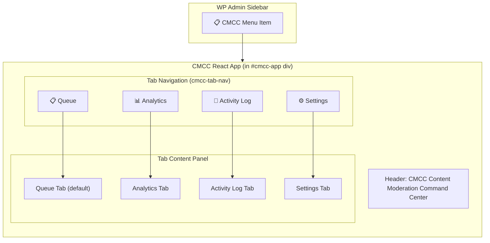

# CMCC UI/UX Specification

## Overview
This document details the user interface and user experience for the Content Moderation Command Center (CMCC) Core (v1) free plugin. The design follows a headless UI approach with platform-adapted theming to ensure consistency across WordPress, Strapi, Storyblok, and Wix while respecting each platform's native design system.

## Design Principles
1. **Consistent UX**: Same interaction patterns, information architecture, and workflows across all platforms
2. **Platform-Adapted UI**: Visual styling derived from each platform's design system
3. **Headless Components**: Shared React components with theme context for platform-specific styling
4. **Accessibility**: WCAG 2.1 AA compliant
5. **Responsive Design**: Works on desktop and tablet views (mobile limited to essential actions)

## User Journey

### 1. Onboarding & Activation
#### WordPress Flow:
- After plugin activation, user sees a notice: "Welcome to CMCC! Run the Setup Wizard to configure your moderation center."
- Button: "Launch Setup Wizard" (primary) and "Maybe Later" (secondary)
- Setup Wizard (3-step modal):
  1. **Welcome**: Brief explanation of CMCC benefits
  2. **Initial Configuration**: 
     - Enable/disable spam firewall (default: on)
     - Set notification threshold (default: 50 pending items)
     - Choose queue refresh interval (default: 30 seconds)
  3. **Complete**: 
     - Success message: "CMCC is ready to use!"
     - Button: "Go to Moderation Center" (primary) and "Explore Settings" (secondary)

#### Strapi/Storyblok/Wix Flows:
Similar onboarding experience adapted to each platform's notification/system modal patterns.

### 2. Main Moderation Center (Queue Page)
#### Layout:
```
+-------------------------------------------------------------+
| [Logo] Moderation Center                                    |
|-------------------------------------------------------------|
| [Filters] [Search] [Bulk Actions Dropdown] [Apply] [Refresh]|
|-------------------------------------------------------------|
| Queue Table (sortable, filterable, paginated)              |
| [Checkbox] [Type] [Title/Excerpt] [Author] [Date] [Status]  |
| [Spam Score] [Quick Actions]                               |
|-------------------------------------------------------------|
| [Pagination Controls]                                      |
+-------------------------------------------------------------+
```

**Detailed Visual (WordPress example):**
```
┌──────────────────────────────────────────────────────────────────┐
│  Moderation Queue                                      [Refresh] │
├──────────────────────────────────────────────────────────────────┤
│  [All Types ▼] [All Status ▼] [Date Range ▼] [🔍 Search...]    │
│  [Bulk Actions ▼] [Apply]  Showing 1-25 of 142 items            │
├──────┬───────┬────────────────┬────────┬────────┬───────┬───────┤
│  ☐   │ Type  │ Content        │ Author │ Status │ Risk  │ Actns │
├──────┼───────┼────────────────┼────────┼────────┼───────┼───────┤
│  ☐   │ 💬    │ "Great post!   │  jdoe  │ Pending│  12%  │[Apprv]│
│      │       │ thanks for..." │        │  ⏳    │       │[Rjct] │
├──────┼───────┼────────────────┼────────┼────────┼───────┼───────┤
│  ☐   │ 📝    │ "Buy cheap     │  spam1 │ Spam   │  97%  │[Apprv]│
│      │       │ watches..."    │        │  🚫   │       │[Rjct] │
├──────┼───────┼────────────────┼────────┼────────┼───────┼───────┤
│  ☐   │ 👤    │ Suspicious     │  newu  │ Flagged│  65%  │[Apprv]│
│      │       │ registration   │        │  ⚠️   │       │[Rjct] │
├──────┴───────┴────────────────┴────────┴────────┴───────┴───────┤
│  ◀ 1 2 3 ... 6 ▶    Page 1 of 6                                │
└──────────────────────────────────────────────────────────────────┘
```

#### Functionality:
- **Filters**:
  - Content Type: All | Comments | Posts | Media | Users | Form Entries | etc.
  - Status: All | Pending | Spam | Flagged
  - Date Range: Today | Yesterday | Last 7 Days | Last 30 Days | Custom
- **Search**: Searches title/excerpt, author name, content
- **Bulk Actions Dropdown**:
  - Approve All
  - Move to Trash
  - Mark as Spam
  - Deactivate User Accounts
  - Export selected to CSV
- **Quick Actions Per Item** (on hover or in column):
  - Approve
  - Reject
  - Mark Spam
  - Defer
- **Table Features**:
  - Sortable by any column
  - Persistent filters in URL
  - Keyboard navigation support
  - Row selection (checkbox + shift-click for range)
  - Empty state: "No items match your filters. Try adjusting your criteria."

#### Content Type Icons:
- Comments: 💬
- Posts/Pages: 📝
- Media: 🖼️
- Users: 👤
- Form Entries: 📋
- WooCommerce Reviews: 🛒
- bbPress: 💬
- BuddyPress: 👥

#### Status Indicators:
- Pending: ⏳ (yellow)
- Spam: 🚫 (red)
- Flagged: ⚠️ (orange)
- Approved: ✅ (green) - shown in history views

### 3. Analytics Dashboard
#### Layout:
```
+-------------------------------------------------------------+
| [Logo] Analytics                                            |
|-------------------------------------------------------------|
| [Date Range Picker] [Refresh]                              |
|-------------------------------------------------------------|
| [Heatmap]          [Spam Ratio Gauge]    [Content Pie]     |
|                                      [Moderator Bar]       |
|-------------------------------------------------------------|
| [Anomaly Alerts Section]                                   |
+-------------------------------------------------------------+
```

**Detailed Visual (WordPress example):**
```
┌──────────────────────────────────────────────────────────────────┐
│  Analytics                                                    │
├──────────────────────────────────────────────────────────────────┤
│  ┌────────┐ ┌────────┐ ┌────────┐ ┌────────┐ ┌────────┐      │
│  │Pending:│ │ Spam:  │ │Flagged:│ │Approved│ │ Total: │      │
│  │   87   │ │   34   │ │   12   │ │  9     │ │  142   │      │
│  └────────┘ └────────┘ └────────┘ └────────┘ └────────┘      │
├──────────────────────────────────────────────────────────────────┤
│  Spam Ratio: ████████████░░░░░░░░░ 23.9%                        │
├──────────────────────────────────────────────────────────────────┤
│  Content Type Breakdown                                         │
│  ┌──────────┬───────┬────────────┐                               │
│  │ Type     │ Count │ Percentage │                               │
│  ├──────────┼───────┼────────────┤                               │
│  │ Comments │   98  │   69.0%    │                               │
│  │ Posts    │   28  │   19.7%    │                               │
│  │ Users    │   12  │    8.5%    │                               │
│  │ Media    │    4  │    2.8%    │                               │
│  └──────────┴───────┴────────────┘                               │
├──────────────────────────────────────────────────────────────────┤
│  Moderation Heatmap (last 30 days)                               │
│  ┌─────────────────────────────────────────────────────────┐    │
│  │   Mon Tue Wed Thu Fri Sat Sun                           │    │
│  │ 0h ██ ██ ░░ ██ ██ ░░ ██                                │    │
│  │ 6h ██████ ██ ████ ██ ████                               │    │
│  │12h ██████████ ██████ ██ ██████                          │    │
│  │18h ████████████████████████████████                     │    │
│  └─────────────────────────────────────────────────────────┘    │
└──────────────────────────────────────────────────────────────────┘
```

#### Components:
1. **Heatmap**:
   - Y-axis: Day of week (Sun-Sat)
   - X-axis: Hour of day (0-23)
   - Color intensity: Number of pending/spam items created
   - Clickable cells: Drill down to queue filtered for that time period
   - Anomaly detection: Cells > threshold show red border + notification icon

2. **Spam Ratio Gauge**:
   - Semi-circular gauge showing: (Spam / Total) * 100%
   - Color: Green (<10%), Yellow (10-25%), Red (>25%)
   - Tooltip: Shows exact numbers and percentage

3. **Content-Type Breakdown Pie Chart**:
   - Shows distribution of pending items by content type
   - Hover: Shows count and percentage
   - Click slice: Filters queue to that content type

4. **Moderator Performance Bar Chart**:
   - Shows approvals/trashes per moderator (past week)
   - Horizontal bars, sorted by activity
   - Tooltip: Shows exact counts

5. **Anomaly Alerts**:
   - Auto-detected unusual patterns (e.g., sudden spam spike)
   - Each alert: Description, timestamp, "Investigate" button
   - Dismissible after investigation

### 4. Activity Log
#### Layout:
```
+-------------------------------------------------------------+
| [Logo] Activity Log                                         |
|-------------------------------------------------------------|
| [Filters] [Search] [Date Range] [Export] [Refresh]         |
|-------------------------------------------------------------|
| Log Table (chronological, newest first)                    |
| [Timestamp] [Moderator] [Action] [Item Type] [Item Title]  |
| [Previous Status] [New Status] [Note] [Undo?]              |
|-------------------------------------------------------------|
| [Pagination Controls]                                      |
+-------------------------------------------------------------+
```

#### Functionality:
- **Filters**:
  - Moderator: Dropdown of all moderators
  - Action: Approve, Reject, Spam, Trash, Deactivate, etc.
  - Item Type: Same as queue filters
  - Date Range: Same as analytics
- **Search**: Searches moderator name, item title, note
- **Actions Per Row**:
  - Undo: Available for actions within 5 minutes (shows countdown)
  - View Details: Opens modal with full action details
- **Table Features**:
  - Sortable by timestamp (default) or any column
  - Auto-prune notice: "Entries older than 90 days are automatically deleted"
  - Configurable retention period (in Settings)

### 5. Settings
#### Layout (Tabbed Interface):
```
+-------------------------------------------------------------+
| [Logo] Settings                                             |
|-------------------------------------------------------------|
| [General] [Spam Firewall] [Notifications] [Advanced] [About]|
|-------------------------------------------------------------|
| Tab Content                                                 |
+-------------------------------------------------------------+
```

**Detailed Visual (WordPress example — General tab):**
```
┌──────────────────────────────────────────────────────────────────┐
│  Settings                                                       │
├──────────────────────────────────────────────────────────────────┤
│  [General] [Spam Firewall] [Notifications] [Advanced] [About]   │
├──────────────────────────────────────────────────────────────────┤
│  General Settings                                               │
│  ┌─────────────────────────────────────────────────────────┐    │
│  │ ☐ Auto-moderation                                       │    │
│  │ Moderation Behavior: [Flag ▼]                           │    │
│  │ Queue Page Size:     [25]                               │    │
│  │ Default View:        ○ Pending  ○ Spam  ○ Flagged       │    │
│  │                       ● All                              │    │
│  │ ☑ Auto-refresh queue  Every [30] seconds                │    │
│  └─────────────────────────────────────────────────────────┘    │
│                                                                  │
│  User Reputation                                                 │
│  ┌─────────────────────────────────────────────────────────┐    │
│  │ ☑ Enable reputation tracking                            │    │
│  │ Approved item score:  [+1]                              │    │
│  │ Rejected/spam score:  [-2]                              │    │
│  │ Deactivation score:   [-10]                             │    │
│  │ Decay rate: [1] pt every [7] days after [30] days idle │    │
│  └─────────────────────────────────────────────────────────┘    │
│                                        [Save Settings]          │
└──────────────────────────────────────────────────────────────────┘
```

#### Tab 1: General
- **Moderation Center**:
  - Enable CMCC (toggle)
  - Items per page: [10] [25] [50] [100] (dropdown)
  - Default view: [Pending] [Spam] [Flagged] [All] (radio)
  - Enable auto-refresh: [x] Every [30] seconds (input)
- **User Reputation**:
  - Enable reputation tracking: [x]
  - Approved item score: [+1] (input)
  - Rejected/spam item score: [-2] (input)
  - Deactivation score: [-10] (input)
  - Decay rate: [1] point every [7] days after [30] days inactive
- **User Interface**:
  - Enable dark mode: [ ] (toggle)
  - Compact queue view: [ ] (toggle)
  - Show avatars: [x] (checkbox)

#### Tab 2: Spam Firewall
- **Enable Spam Firewall**: [x] (toggle)
- **Global Action** (when rule triggers):
  - [ ] Flag for review
  - [x] Silently discard
  - [ ] Send to spam (comments only)
- **Rules** (each with enable toggle, threshold input, and help tooltip):
  - Max links in content: [3] (default: 3)
  - Blacklisted keywords: [textarea, one per line]
    - Supports wildcards: *free*, *viagra*
  - Blacklisted IP addresses: [textarea, CIDR supported]
  - Blacklisted email domains: [textarea, e.g., example.com]
  - Country blocking: [multiselect dropdown] (uses GeoLite2)
  - Content submitted too quickly: [x] Enable
    - Minimum time: [5] seconds
  - Duplicate content detection: [x] Enable
    - Lookback period: [30] days
- **Save Changes** button (primary) and **Reset to Defaults** (secondary)

#### Tab 3: Notifications
- **Email Notifications**:
  - Enable email alerts: [x]
  - Pending queue threshold: [50] items
  - Notify moderators: [multiselect] (defaults to all admins/mods)
  - From email: [wordpress@yoursite.com]
  - Reply-to: [admin@yoursite.com]
- **Daily Digest**:
  - Enable daily digest: [x]
  - Delivery time: [08:00] AM (time picker)
  - Include: [x] Queue totals [x] Spam ratio [x] Top offenders
- **Dashboard Alerts**:
  - Enable in-app alerts: [x]
  - Show anomaly indicators: [x]
  - Alert persistence: [Until dismissed] [24 hours] [1 week]
- **Save Changes** button

#### Tab 4: Advanced
- **Database**:
  - Table prefix: [wp_cmcc_] (readonly, shows actual prefix)
  - [Optimize Tables] button
  - [Repair Tables] button
  - [Clear All CMCC Data] button (with confirmation modal)
- **Logging**:
  - Audit log retention: [90] days
  - Enable debug logging: [ ]
  - [Download Log] button
- **Multisite** (only visible in WP Multisite):
  - Enable network moderation: [x]
  - Network super admin can: [View all] [View and moderate]
- **Save Changes** button

#### Tab 5: About
- **CMCC Version**: [1.0.0]
- **WordPress Version**: [6.4.2]
- **PHP Version**: [8.1.0]
- **MySQL Version**: [8.0.32]
- **License**: GPLv2+
- **Links**:
  - [Documentation]
  - [Support Forum]
  - [Rate Us]
  - [Donate]
  - [Upgrade to Pro]
- **Credits**: List of contributors and third-party libraries

## Platform-Specific Adaptations

### WordPress
- Uses WP admin colors: #007cba (primary), #f0f0f1 (background)
- System font: -apple-system, BlinkMacFont, 'Segoe UI', Roboto, sans-serif
- Integrates with WP notices, metaboxes, and buttons
- Settings use WP Settings API with tabbed interface
- Queue table uses WP_List_Table or custom React implementation
- Analytics use wp_ajax for data fetching

**Application Architecture (WordPress):**


**Visual Design Details (WordPress):**

| Element | WordPress Style |
|---|---|
| **Primary Color** | `#007cba` (WP admin blue) |
| **Background** | `#f0f0f1` (WP admin grey) |
| **Font** | `-apple-system, BlinkMacSystemFont, 'Segoe UI', Roboto, sans-serif` |
| **Cards/Tables** | White background (`#fff`), 1px border `#c3c4c7` |
| **Buttons** | Mirrors WP admin button styles |
| **Status Colors** | Pending=🟡 `#f0ad4e`, Spam=🔴 `#d9534f`, Flagged=🟠 `#f56e28`, Approved=🟢 `#46b450` |
| **Scoping** | Everything under `#cmcc-app` to avoid WP admin style conflicts |

### Strapi
- Uses Strapi Design System (Buffet.js) tokens:
  - Primary: #ff3860
  - Background: #fafafa
  - Font: System UI stack
- Layout: Strapi's Layout component with SlotFill
- Components styled with Strapi's Box, Typography, Button
- Uses Strapi's notification system
- Settings page built with Strapi's custom field plugins

### Storyblok
- Matches Storyblok App Container styling:
  - Background: #ffffff
  - Primary: #0066ff (Storyblok blue)
  - Font: Inter, system fallback
- Uses Storyblok's App SDK for styling
- Iframe-resizable container
- Settings use Storyblok's datasource or custom field approach
- Analytics use Storyblok's Management API for data

### Wix
- Uses Wix Design System (Stylable):
  - Primary: #ff6b6b (Wix coral)
  - Background: #ffffff
  - Font: Barbara Sen, system fallback
- Built as Wix Dashboard App with Velo
- Uses Wix UI components: Button, Input, Dropdown, etc.
- Settings stored in Wix Collections
- Analytics use Wix Charts API or embedded Chart.js
- Follows Wix's responsive grid system

## Component Library Specification

### Shared Components (@cmcc/ui)
All components receive a `theme` prop via context and use it for styling.

#### CMCCQueueTable
- Props: 
  - `items`: Array of queue items
  - `onBulkAction`: (actionType, selectedIds) => void
  - `onItemAction`: (actionType, itemId) => void
  - `filters`: Current filter state
  - `onFilterChange`: (newFilters) => void
  - `isLoading`: boolean
  - `totalCount`: number
- Features:
  - Column toggling (via checkbox in header)
  - Responsive columns (hide less important on narrow screens)
  - Bulk selection with shift-click
  - Row actions menu (inline or dropdown)

#### CMCCCharts
- Props:
  - `chartType`: 'heatmap' | 'gauge' | 'pie' | 'bar'
  - `data`: Chart-specific data structure
  - `options`: Chart.js options (merged with theme)
  - `onClick`: (dataPoint) => void (for drill-down)
- Features:
  - Responsive canvas
  - Tooltips with formatting
  - Animations on update
  - Legend toggling (where applicable)

#### CMCCSettingsForm
- Props:
  - `sections`: Array of section objects
  - `onSubmit`: (formData) => void
  - `initialValues`: object
  - `validators`: object (field-level validation)
- Features:
  - Tabbed navigation
  - Inline validation
  - Dirty form detection (warn on unsaved changes)
  - Reset to initial values
  - Submit loading state

#### CMCCNotificationBadge
- Props:
  - `count`: number
  - `type`: 'pending' | 'spam' | 'alert'
  - `onClick`: () => void
- Features:
  - Pulsing animation for new items
  - Tooltip on hover
  - Accessible label (aria-label)

#### CMCCActionButton
- Props:
  - `variant`: 'primary' | 'secondary' | 'danger' | 'ghost'
  - `size`: 'sm' | 'md' | 'lg'
  - `icon`: ReactComponent (optional)
  - `loading`: boolean
  - `disabled`: boolean
  - `onClick`: () => void
- Features:
  - Loading spinner
  - Icon positioning (left/right)
  - Outline vs filled variants
  - Accessible keyboard navigation

## Interaction Details

### Queue Item Moderation Flow:
1. User clicks "Approve" on item
2. Optimistic UI: Item immediately shows as approved (with animation)
3. Background: API call to approve item
4. On success: 
   - Item removed from queue (with fade-out)
   - Success toast: "Item approved"
   - Analytics and activity log updated in real-time
5. On error:
   - Item reverts to pending state (with shake animation)
   - Error toast: "Failed to approve item. Please try again."
   - Log error to console (and to server if configured)

### Bulk Actions Flow:
1. User selects items (checkboxes)
2. Chooses action from dropdown
3. Clicks "Apply"
4. Confirmation modal: "Are you sure you want to [action] [count] items?"
5. On confirm:
   - Selected items show processing state
   - Background: Batch API call
   - On success: Items removed, success toast with count
   - On error: Items revert, error toast with failed count

### Settings Save Flow:
1. User modifies setting
2. Form field shows "unsaved change" indicator (dot)
3. User clicks "Save Changes"
4. Button shows loading state
5. Background: Save API call
6. On success:
   - Button shows success checkmark briefly
   - All unsaved indicators removed
   - Success toast: "Settings saved"
   - Apply changes immediately (no page reload needed)
7. On error:
   - Button shows error state
   - Error toast: "Failed to save settings"
   - Fields retain edited values

## Error Handling & Edge Cases

### Empty States:
- Queue: "No items match your filters. Try adjusting your criteria."
- Analytics: "No data available for the selected period."
- Activity Log: "No actions recorded yet."
- Settings: N/A (always has content)

### Loading States:
- Skeleton loaders for tables and charts
- Button loading states
- Page-level loader for initial load (only on slow connections)

### Error Boundaries:
- React error boundaries around major sections
- Fallback UI: "Something went wrong. Please refresh the page."
- Error reporting to monitoring service (in production)

### Network Issues:
- Queue shows stale data with warning banner
- Retry mechanism for failed requests
- Offline indicator: "You're offline. Changes will sync when back online."

## Accessibility Features

### Keyboard Navigation:
- All interactive elements reachable via Tab
- Visible focus outlines (2px solid, theme color)
- Arrow key navigation in tables and menus
- Escape closes modals and dropdowns
- Enter/Space activates buttons

### Screen Reader Support:
- Proper ARIA labels and roles
- Live regions for announcements (e.g., "5 items approved")
- Landmark regions (navigation, main, complementary)
- Skip to content link
- Form labels and error messages

### Color Contrast:
- All text meets WCAG AA (4.5:1) or AAA (7:1) for large text
- UI components use theme colors that adapt to light/dark modes
- Focus and hover states have sufficient contrast

### Motion Sensitivity:
- Respects `prefers-reduced-motion` media query
- Animations disabled or simplified when requested
- Transitions use fade/slide instead of zoom/spin when reduced motion

## Performance Considerations

### Data Fetching:
- Queue: Paginated loading (25 items per page)
- Analytics: Cached for 5 minutes, invalidated on queue changes
- Activity Log: Paginated, loads more on scroll
- Settings: Loaded once on mount, saved on change

### Rendering Optimization:
- React.memo for expensive components
- Virtualized lists for long queues (using react-window)
- Debounced search and filter inputs
- RequestAnimationFrame for animations

### Asset Optimization:
- Lazy-loaded charts and heavy components
- Code-splitting by route (Queue, Analytics, Log, Settings)
- Minimized CSS and JS
- Critical CSS above-the-fold

## Future Enhancements (v2 Considerations)

### AI Integration Points:
- AI decision badge in queue item
- AI settings tab in Settings
- Batch AI review button in queue
- AI risk score in user reputation tooltip

### Collaboration Features:
- Real-time moderator cursors in queue
- Comment threads on moderation actions
- Assignment of items to specific moderators
- Moderation rules sharing between sites

### Customization:
- Drag-and-drop column reordering in queue
- Saved filter presets
- Custom dashboard layouts
- White-labeling options for agencies

---
*This specification defines the v1 Core (free) user experience. The v2 Pro version will extend this with AI features while maintaining the same core UX patterns.*