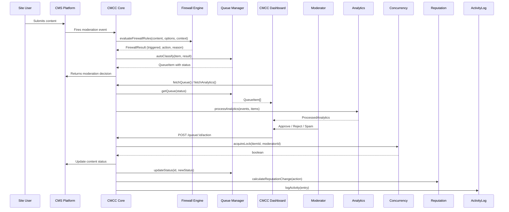

# CMCC — Content Moderation Command Center Developer Guide

> **Version:** 1.0.0  
> **Monorepo:** Turborepo + npm workspaces  
> **Last updated:** 2026-06-06

---

## Table of Contents

1. [Project Overview](#1-project-overview)
2. [Getting Started](#2-getting-started)
3. [Package: @cmcc/core](#3-package-cmccore)
   - [Analytics Engine](#analytics-srcanalyticsindexts)
   - [Concurrency Control](#concurrency-srcconcurrencyts)
   - [Firewall Rule Engine](#firewall-srcfirewallrulests)
   - [Queue Processor](#queues-srcqueuesindexts)
   - [Reputation System](#reputation-srcreputationindexts)
4. [Package: @cmcc/ui](#4-package-cmccui)
   - [HeatmapChart](#heatmapchart-componentsanalyticsheatmapcharttsx)
   - [QueueTable](#queuetable-componentsqueuequeuetabletsx)
   - [ActionButton](#actionbutton-componentscommonactionbuttontsx)
   - [NotificationBadge](#notificationbadge-componentscommonnotificationbadgetsx)
   - [SettingsForm](#settingsform-componentssettingssettingsformtsx)
5. [Platform: WordPress](#5-platform-wordpress)
6. [Platform: Strapi](#6-platform-strapi)
7. [Platform: Storyblok](#7-platform-storyblok)
8. [Platform: Wix](#8-platform-wix)
9. [Platform: Shopify](#9-platform-shopify)
10. [Shared Data Flow](#10-shared-data-flow)
11. [Testing Strategy](#11-testing-strategy)
12. [Code Style & Conventions](#12-code-style--conventions)
13. [Build & Deploy](#13-build--deploy)

---

## 1. Project Overview

### What Is CMCC?

CMCC (Content Moderation Command Center) is a multi-platform content moderation system that provides a unified dashboard for moderating user-generated content across different CMS platforms. It combines queue management, spam detection via a firewall rule engine, real-time analytics, user reputation scoring, and concurrency control in a single, extensible architecture.

**Supported platforms:**

| Platform | Integration Type | Language |
|----------|----------------|----------|
| WordPress | Native PHP plugin with React UI | PHP + JSX |
| Strapi | Strapi plugin (server + admin) | JavaScript (Node) |
| Storyblok | Iframe app via SDK | JavaScript (Browser) |
| Wix | Dashboard iframe app | JavaScript (Browser) |
| Shopify | Embedded Polaris app | JavaScript (Browser) |

### Monorepo Architecture

```mermaid
graph TD
    CMCC[cmcc/] --> Packages
    CMCC --> Platforms
    Packages --> Core[@cmcc/core]
    Packages --> UI[@cmcc/ui]
    Core --> Analytics
    Core --> Firewall
    Core --> Queue
    Core --> Reputation
    Core --> Concurrency
    Platforms --> WP[wordpress/]
    Platforms --> Strapi[strapi/]
    Platforms --> Storyblok[storyblok/]
    Platforms --> Wix[wix/]
    Platforms --> Shopify[shopify/]
    WP --> CMCCPHP[cmcc.php]
    WP --> ReactApp[src/App.jsx]
    Strapi --> Server[server/]
    Strapi --> Admin[admin/src/]
```

The monorepo uses:

- **Turborepo** (`turbo.json`) — orchestrates build, test, dev, and lint tasks across all packages and platforms.
- **npm workspaces** — defined in the root `package.json` via the `"workspaces"` key covering `packages/*` and `platforms/*`.
- **Pipeline dependencies** — `build` depends on `^build` (upstream builds complete first); `test` depends on `^build` (tested code must be built first).

### Technology Stack

| Layer | Technology |
|-------|-----------|
| Language | TypeScript 5.x (strict mode), PHP 8.x (WordPress) |
| UI Framework | React 18 |
| Build | Turborepo, Webpack 5, tsc, Babel |
| Testing | Jest 29, ts-jest, @testing-library/react |
| Linting | ESLint 9 (flat config), Prettier 3 |
| Package Manager | npm 11+ |
| Runtime | Node 24+ |

---

## 2. Getting Started

### Prerequisites

- **Node.js** v24 or later
- **npm** 11 or later
- **PHP** 8.0+ (only required for WordPress platform development)
- **Composer** (only if developing WordPress platform with PHP dependencies)

### Clone and Install

```bash
git clone <repository-url> cmcc
cd cmcc
npm install --legacy-peer-deps
```

> `--legacy-peer-deps` is required because several platform packages declare React 18 as both a `peerDependency` and a `devDependency`, which newer npm versions treat as a conflict.

### Build All Packages

```bash
npm run build
# Internally: turbo run build
```

This runs `build` scripts in dependency order:
1. `@cmcc/core` — compiled by `tsc` to `packages/cmcc-core/dist/`
2. `@cmcc/ui` — compiled by `tsc` to `packages/cmcc-ui/dist/`
3. WordPress plugin — bundled by Webpack to `platforms/wordpress/dist/`

### Run All Tests

```bash
npm test
# Internally: turbo run test
```

### Development Workflow

```bash
npm run dev
# Internally: turbo run dev --parallel
```

Starts TypeScript watch mode for `@cmcc/core` and `@cmcc/ui`, and Webpack watch mode for the WordPress platform, all in parallel.

### Linting & Formatting

```bash
npm run lint          # Turbo-based lint for all workspaces
npm run lint:eslint   # Root-level ESLint check
npm run lint:fix      # Auto-fix ESLint issues
npm run format        # Prettier check
npm run format:fix    # Auto-format
```

---

## 3. Package: @cmcc/core

**Location:** `packages/cmcc-core/`  
**npm name:** `@cmcc/core`  
**Entry:** `src/index.ts` (barrel re-exporting all submodules)  
**Build:** `tsc` → output to `dist/`

### Analytics (`src/analytics/index.ts`)

The analytics engine processes moderation events to produce dashboard insights: heatmaps, spam ratios, content breakdowns, moderator performance, anomaly alerts, activity log filtering, and trend analysis.

#### Core Data Types

```typescript
interface ModerationEvent {
  id: string | number
  timestamp: string          // ISO date string
  contentType: string
  action: string
  itemId: string | number
  userId: string | number
  blogId?: string | number
  moderatorId?: string | number
}

interface QueueItem {
  id: string
  contentType: string
  originalId: string | number
  status: 'pending' | 'spam' | 'flagged'
  spamScore: number
  authorId: string | number
  dateGmt: string            // ISO date string
  title: string
  excerpt: string
}

interface ProcessedAnalytics {
  heatmap: HeatmapData
  spamRatio: SpamRatioData
  contentTypeBreakdown: ContentTypeBreakdown[]
  moderatorPerformance: ModeratorPerformance[]
  anomalyAlerts: AnomalyAlert[]
  dateRange: { start: string; end: string }
}

interface AnalyticsOptions {
  heatmapLookbackDays: number
  anomalyThresholds: {
    queueVolumePerHour: number
    spamRatio: number
    moderatorActionsPerHour: number
  }
}

interface HeatmapData {
  data: number[][]       // 7 rows (days 0-6) × 24 columns (hours 0-23)
  maxCount: number
}

interface SpamRatioData {
  spamCount: number
  totalCount: number
  ratio: number
  percentage: number
}

interface ContentTypeBreakdown {
  contentType: string
  count: number
  percentage: number
}

interface ModeratorPerformance {
  moderatorId: string | number
  moderatorName: string
  approvals: number
  trashes: number
  spamCount: number
  totalActions: number
}

interface AnomalyAlert {
  id: string
  type: 'queue_volume' | 'spam_ratio' | 'moderator_activity'
  severity: 'low' | 'medium' | 'high'
  description: string
  timestamp: string
  value: number
  threshold: number
}
```

#### Helper Types (v1 Enhancements)

```typescript
interface ActivityLogEntry {
  id: string
  timestamp: string
  moderatorId: string | number
  moderatorName?: string
  action: 'approved' | 'rejected' | 'spammed' | 'trashed' | 'flagged'
        | 'deactivated' | 'deferred'
  contentType: string
  itemId: string | number
  itemTitle?: string
  previousStatus?: string
  newStatus?: string
  notes?: string
}

interface ActivityLogFilter {
  moderatorIds?: (string | number)[]
  actions?: ActivityLogEntry['action'][]
  contentTypes?: string[]
  dateFrom?: string
  dateTo?: string
  search?: string
  limit?: number
  offset?: number
}

interface TrendData {
  currentValue: number
  previousValue: number
  change: number
  percentageChange: number
  direction: 'up' | 'down' | 'stable'
}
```

#### Key Functions

---

##### `generateHeatmapData(events, options?)`

```typescript
function generateHeatmapData(
  events: ModerationEvent[],
  options?: Pick<AnalyticsOptions, 'heatmapLookbackDays'>,
): HeatmapData
```

**Purpose:** Creates a 7-day × 24-hour grid counting pending and spam content created within the lookback window.

**Parameters:**
- `events` — Array of all moderation events.
- `options.heatmapLookbackDays` — How many days back to analyze (default: 30).

**Execution flow:**
1. Initialize a 7×24 grid filled with zeros.
2. Calculate cutoff time from `now - lookbackDays`.
3. Iterate events, filtering to those within the lookback window where `action === 'created'` and `contentType` is `'comment'` or `'post'`.
4. Increment the cell at `[dayOfWeek][hour]`, tracking `maxCount`.
5. Return `{ data, maxCount }`.

**Returns:** A `HeatmapData` object.

---

##### `calculateSpamRatio(events, anomalyThresholds?)`

```typescript
function calculateSpamRatio(
  events: ModerationEvent[],
  options?: Pick<AnalyticsOptions, 'anomalyThresholds'>,
): SpamRatioData
```

**Purpose:** Computes the ratio of spam actions to total moderation actions in the last hour.

**Parameters:**
- `events` — Moderation events.
- `options.anomalyThresholds` — Threshold configuration (used for consistency but only ratio is returned).

**Execution flow:**
1. Filter events in the last hour.
2. Count `spammed` actions (spamCount) and `approved`/`spammed`/`trashed` actions (totalCount) for comments/posts.
3. Compute `ratio = spamCount / totalCount` (0 when totalCount is 0).
4. Return counts, ratio, and rounded percentage.

---

##### `generateContentTypeBreakdown(items)`

```typescript
function generateContentTypeBreakdown(
  items: QueueItem[],
): ContentTypeBreakdown[]
```

**Purpose:** Tallies queue items by content type, computing percentage of total.

**Execution flow:**
1. Count items grouped by `contentType`.
2. Convert to array with percentages, sorted descending by count.

---

##### `generateModeratorPerformance(events, moderatorNames?)`

```typescript
function generateModeratorPerformance(
  events: ModerationEvent[],
  moderatorNames?: Record<string | number, string>,
): ModeratorPerformance[]
```

**Purpose:** Computes per-moderator action counts for the past week.

**Execution flow:**
1. Filter events to the last 7 days that have a `moderatorId`.
2. Count `approved`, `trashed`, `spammed` actions per moderator.
3. Map to `ModeratorPerformance[]` sorted by total actions descending.
4. Unknown moderators get the label `"Moderator {id}"`.

---

##### `detectAnomalies(events, queueItems, options?)`

```typescript
function detectAnomalies(
  events: ModerationEvent[],
  queueItems: QueueItem[],
  options?: Pick<AnalyticsOptions, 'anomalyThresholds'>,
): AnomalyAlert[]
```

**Purpose:** Detects three types of anomalies in the last hour:
1. **Queue volume** — Unusually high number of pending/spam item creations.
2. **Spam ratio** — Spam ratio exceeding threshold (default 50%).
3. **Moderator activity** — A single moderator performing too many actions.

**Severity:** `'high'` when value exceeds 2× threshold, otherwise `'medium'`.

**Execution flow:**
1. Count recent creations; if above `queueVolumeThreshold`, create alert.
2. Call `calculateSpamRatio`; if ratio above `spamRatioThreshold`, create alert.
3. Count actions per moderator; any above `moderatorActivityThreshold` gets an alert.

---

##### `processAnalytics(events, queueItems, moderatorNames?, options?)`

```typescript
function processAnalytics(
  events: ModerationEvent[],
  queueItems: QueueItem[],
  moderatorNames?: Record<string | number, string>,
  options?: Partial<AnalyticsOptions>,
): ProcessedAnalytics
```

**Purpose:** Master function that runs all analytics in one call. Merges provided options with defaults, runs each sub-analysis, computes date range from events, and returns a complete `ProcessedAnalytics` object.

**Usage example:**

```typescript
import { processAnalytics } from '@cmcc/core'

const analytics = processAnalytics(events, queueItems, {
  1: 'Alice',
  2: 'Bob',
})
```

##### `filterActivityLog(entries, filter)`

```typescript
function filterActivityLog(
  entries: ActivityLogEntry[],
  filter?: ActivityLogFilter,
): ActivityLogEntry[]
```

**Purpose:** Filters, sorts (newest first), and paginates activity log entries. All filter fields are optional. Supports searching across `itemTitle`, `moderatorName`, and `notes`.

---

##### `calculateTrend(events, predicate, currentPeriodStart, ...)`

```typescript
function calculateTrend(
  events: ModerationEvent[],
  predicate: (event: ModerationEvent) => boolean,
  currentPeriodStart: string,
  currentPeriodEnd?: string,
  previousPeriodDuration?: number,
): TrendData
```

**Purpose:** Period-over-period comparison. Counts events matching `predicate` in the current period and the previous period (same duration, immediately preceding). Returns absolute change, percentage change, and direction (`'up'` / `'down'` / `'stable'` within ±5%).

---

##### `getDateRangeForPeriod(period)`

```typescript
function getDateRangeForPeriod(
  period: 'today' | 'yesterday' | 'last7days' | 'last30days' | 'last90days' | 'all',
): { start: string; end: string }
```

**Purpose:** Convenience helper returning ISO date range bounds for common time periods. `'yesterday'` returns a closed range for just that day; `'all'` starts at Unix epoch.

---

#### Helper Functions

```typescript
function getDefaultAnalyticsOptions(): AnalyticsOptions
function getEmptyAnalytics(): ProcessedAnalytics
```

`getEmptyAnalytics()` returns a zeroed-out state for initial loading / empty states in the UI.

---

### Concurrency (`src/concurrency.ts`)

Prevents multiple moderators from acting on the same queue item simultaneously. This is an in-memory implementation; production deployments should replace it with a distributed store (Redis, etc.).

#### Interfaces

```typescript
interface LockInfo {
  lockedBy: string | null       // moderator ID
  expiresAt: number | null      // timestamp in milliseconds
}

interface LockManagerStats {
  totalAcquisitions: number
  totalReleases: number
  totalRejections: number
  totalTimeouts: number
  activeLocks: number
}

interface ConcurrencyOptions {
  defaultLockTimeout?: number         // seconds, default 30
  cleanupIntervalSeconds?: number     // default 60
}
```

#### `InMemoryLockManager` Class

```typescript
class InMemoryLockManager {
  constructor(options?: ConcurrencyOptions)
```

**Internal state:** A `Map<string, { moderatorId, expiresAt }>` of active locks, a stats accumulator, and a cleanup interval timer.

**Methods:**

| Method | Signature | Description |
|--------|-----------|-------------|
| `acquireLock` | `(itemId, moderatorId, lockTimeoutSeconds?) => boolean` | Acquires a lock. Returns `true` if successful. If same moderator re-acquires, the lock expiry is extended. If held by another moderator (not expired), returns `false`. Expired locks are overwritten. |
| `releaseLock` | `(itemId, moderatorId) => boolean` | Releases a lock only if `moderatorId` matches the holder. Returns `false` if no lock or wrong holder. |
| `getLockInfo` | `(itemId) => LockInfo` | Returns lock status. Automatically cleans up expired locks on read. |
| `forceReleaseLock` | `(itemId) => boolean` | Admin override — releases regardless of holder. |
| `getActiveLocks` | `() => LockInfo[]` | Returns all non-expired locks. |
| `getStats` | `() => LockManagerStats` | Returns cumulative statistics. |
| `clearAllLocks` | `() => void` | Clears all locks (useful for testing). |
| `stop` | `() => void` | Clears the cleanup interval timer. Call when shutting down. |

**Internal cleanup flow:**

```
setInterval(cleanupExpiredLocks, cleanupIntervalSeconds * 1000)
    │
    └── For each lock where expiresAt <= now:
          → delete from map
          → increment stats.totalTimeouts
```

**Factory function:**

```typescript
function getDefaultLockManager(): InMemoryLockManager
```

---

### Firewall (`src/firewall/rules.ts`)

A platform-agnostic rule engine that evaluates content against configurable spam firewall rules. Results determine whether content is flagged, discarded, or marked as spam.

#### Interfaces

```typescript
interface FirewallRuleOptions {
  maxLinks?: number
  blacklistedKeywords?: string[]
  blacklistedIPs?: string[]
  blacklistedEmailDomains?: string[]
  blockedCountries?: string[]           // ISO country codes
  minSubmitTime?: number                // seconds
  enableDuplicateDetection?: boolean
  duplicateLookbackDays?: number
  duplicateThreshold?: number           // max Hamming distance for simhash (default: 3)
  globalAction?: 'flag' | 'discard' | 'spam'
  ruleActions?: Record<string, 'flag' | 'discard' | 'spam'>
}

interface FirewallResult {
  triggered: boolean
  action: 'flag' | 'discard' | 'spam' | null
  reason: string
  ruleName: string
}
```

#### Rule Functions

All individual rule checkers return `{ triggered, ...data }` objects.

| Function | Signature | Description |
|----------|-----------|-------------|
| `simhash` | `(content: string) => string` | Computes a 64-bit simhash as a hex string. Tokenizes by non-alphanumeric characters, hashes each token with a BigInt polynomial hash (h = h×31 + charCode), aggregates bit vectors, and produces the final 64-bit fingerprint. |
| `checkLinkCount` | `(content, maxLinks?) => { triggered, count }` | Counts `https?://` URLs in content via regex. Default max: 3. |
| `checkBlacklistedKeywords` | `(content, keywords?) => { triggered, matchedKeyword }` | Case-insensitive matching with wildcard support: `*keyword*` (contains), `keyword*` (starts with), `*keyword` (ends with), plain (contains). |
| `checkBlacklistedIP` | `(ip, blacklistedIPs?) => { triggered, matchedIP }` | Supports exact IP and CIDR notation (e.g., `192.168.1.0/24`). Uses `isIPInCIDRRange` helper. |
| `checkBlacklistedEmailDomain` | `(email, domains?) => { triggered, matchedDomain }` | Extracts domain after `@`, compares case-insensitively. |
| `checkBlockedCountry` | `(countryCode, blockedCountries?) => { triggered, matchedCountry }` | Case-insensitive ISO country code comparison. |
| `checkSubmitTime` | `(timeDelta, minTime?) => { triggered, timeDelta }` | Honeypot / fast-submit detection. Default minimum: 5 seconds. |
| `checkDuplicateContent` | `(contentHash, recentHashes?, threshold?) => { triggered, isDuplicate }` | Compares simhash against a set of recent hashes using Hamming distance. Default threshold: 3. |

**Helper:** `isIPInCIDRRange(ip: string, cidr: string): boolean` — converts dotted-quad to 32-bit integer, applies CIDR mask, and compares.

#### Master Evaluation

```typescript
function evaluateFirewallRules(
  content: string,
  options?: FirewallRuleOptions,
  context?: {
    authorIP?: string
    authorEmail?: string
    submitTimeDelta?: number
    contentHash?: string
    recentHashes?: Set<string>
    countryCode?: string
  },
): FirewallResult
```

**Evaluation order (priority):**

1. **Link count** (`maxLinks`) → default action: `flag`
2. **Blacklisted keywords** (`blacklistedKeywords`) → default action: `discard`
3. **Blacklisted IP** (`blacklistedIPs`) → default action: `discard`
4. **Blacklisted email domain** (`blacklistedEmailDomains`) → default action: `discard`
5. **Blocked country** (`blockedCountries`) → default action: `discard`
6. **Submit time** (`submitTime`) → default action: `discard`
7. **Duplicate content** (`duplicateContent`) → default action: `flag`

Rules are short-circuited — the first triggered rule immediately returns with its resolved action. Action resolution priority:
1. Per-rule override in `ruleActions[ruleName]`
2. Global `globalAction`
3. Hard-coded per-rule default (as listed above)

#### Stats Tracking

```typescript
function getFirewallRuleStats(): FirewallRuleStats
function resetFirewallRuleStats(): void
```

Internal `ruleStatsMap` counts how many times each rule name was triggered. Useful for monitoring and tuning.

#### Default Configuration

```typescript
function getDefaultFirewallOptions(): FirewallRuleOptions
// Returns: { maxLinks: 3, blacklistedKeywords: [], blacklistedIPs: [],
//            blacklistedEmailDomains: [], blockedCountries: [],
//            minSubmitTime: 5, enableDuplicateDetection: true,
//            duplicateLookbackDays: 30, duplicateThreshold: 3 }
```

---

### Queues (`src/queues/index.ts`)

In-memory queue management for the moderation workflow. Provides enqueue/dequeue, status tracking, stats, and automatic classification based on firewall results.

#### Interface

```typescript
interface QueueStats {
  pending: number
  spam: number
  flagged: number
  total: number
}
```

#### `QueueManager` Class

```typescript
class QueueManager {
  private queue: QueueItem[] = []
```

| Method | Signature | Description |
|--------|-----------|-------------|
| `enqueue` | `(item) => void` | Adds item to end of queue. |
| `dequeue` | `() => QueueItem \| undefined` | Removes and returns first item. |
| `peek` | `() => QueueItem \| undefined` | Returns first item without removing. |
| `updateStatus` | `(id, newStatus) => boolean` | Finds by ID and updates status. Returns `false` if not found. |
| `remove` | `(id) => boolean` | Removes item by ID. Returns `false` if not found. |
| `getQueue` | `(status?) => QueueItem[]` | Returns shallow copy, optionally filtered by status. |
| `getQueueStats` | `() => QueueStats` | Returns counts of pending/spam/flagged/total. |
| `processNext` | `<T>(callback) => T \| undefined` | Dequeues and passes item to callback. Returns callback result or `undefined`. |
| `autoClassify` | `(item, firewallResult) => QueueItem` | Returns a new item with status set based on firewall action: `'spam'` → `'spam'`, `'flag'` → `'flagged'`, `'discard'` → `'spam'`, not triggered → `'pending'`. |

---

### Reputation (`src/reputation/index.ts`)

User reputation scoring system with score decay, breach tracking, risk level classification, and a storage adapter interface.

#### Interfaces

```typescript
interface ReputationScore {
  score: number
  lastUpdated: string           // ISO date
  totalApproved: number
  totalRejected: number
  timesDeactivated: number
}

interface BreachRecord {
  id: string
  userId: string | number
  timestamp: string
  reason: string
  moderatorId: string | number
  contentType: string
  contentId: string | number
}

interface ReputationOptions {
  approvedItemScore: number         // default: 1
  rejectedItemScore: number         // default: -2
  deactivationScore: number         // default: -10
  decayEnabled: boolean             // default: true
  decayRatePerPeriod: number        // default: 1
  decayPeriodDays: number           // default: 7
  inactivityThresholdDays: number   // default: 30
}

type RiskLevel = 'low' | 'medium' | 'high' | 'critical'

interface RiskLevelThresholds {
  criticalScoreThreshold: number    // default: -10
  highRiskScoreThreshold: number    // default: -5
  mediumRiskScoreThreshold: number  // default: -2
  criticalBreachThreshold: number   // default: 6
  highBreachThreshold: number       // default: 3
  mediumBreachThreshold: number     // default: 1
}

interface BreachFrequency {
  totalBreaches: number
  breachesPerDay: number
  periodDays: number
  byReason: Record<string, number>
}

interface UserReputationSummary {
  currentScore: number
  riskLevel: RiskLevel
  recentBreachCount: number
  breachFrequency: BreachFrequency
  totalApproved: number
  totalRejected: number
  timesDeactivated: number
  lastUpdated: string | null
}
```

#### Key Functions

| Function | Signature | Description |
|----------|-----------|-------------|
| `calculateReputationChange` | `(action, options) => number` | Returns score delta: `'approve'` → +1, `'reject'`/`'spam'` → -2, `'deactivate'` → -10 (default values). |
| `calculateDecayedScore` | `(currentScore, lastActivityDate, currentDate, options) => number` | Applies decay toward zero if inactivity exceeds `inactivityThresholdDays`. Each `decayPeriodDays` of additional inactivity subtracts `decayRatePerPeriod`. Positive scores decay downward, negative scores decay upward. |
| `isHighRiskUser` | `(score, recentBreachCount, options) => boolean` | Returns `true` if score ≤ `highRiskThreshold` (-5) OR breaches ≥ `recentBreachThreshold` (3). |
| `classifyRiskLevel` | `(score, recentBreachCount, thresholds?) => RiskLevel` | Classifies user into `critical`/`high`/`medium`/`low` using score and breach thresholds. Critical overrides all. |
| `calculateBreachFrequency` | `(breaches, periodDays?) => BreachFrequency` | Returns total breaches, breaches per day, and breakdown by reason. |
| `generateUserReputationSummary` | `(score, breaches, options?, riskThresholds?, breachLookbackDays?) => UserReputationSummary` | Combines all reputation data into a single comprehensive summary. |

#### Storage Adapter

```typescript
interface ReputationStorageAdapter {
  getReputationScore(userId): Promise<ReputationScore | null>
  saveReputationScore(userId, score): Promise<void>
  getUserBreaches(userId, limit?): Promise<BreachRecord[]>
  addBreachRecord(breach): Promise<string>      // returns breach ID
  clearOldBreachRecords(beforeDate): Promise<void>
}
```

**`InMemoryReputationAdapter`** — A Map-based implementation for testing and demo purposes. Stores scores and breaches in-memory with auto-incrementing breach IDs. Not suitable for production multi-server environments.

**Default helpers:**

```typescript
function getDefaultReputationOptions(): ReputationOptions
function getDefaultHighRiskThresholds(): { highRiskThreshold, recentBreachThreshold }
function getDefaultRiskLevelThresholds(): RiskLevelThresholds
```

---

## 4. Package: @cmcc/ui

**Location:** `packages/cmcc-ui/`  
**npm name:** `@cmcc/ui`  
**Entry:** `src/index.ts` (barrel exports)  
**Peer dependencies:** `react@^18`, `react-dom@^18`

All components use CSS class names prefixed with `cmcc-` to avoid style conflicts. They are "headless" in the sense that they accept data and callbacks as props and render inline styles + class names — no external CSS import required.

### HeatmapChart (`components/analytics/HeatmapChart.tsx`)

```typescript
interface HeatmapChartProps {
  data: HeatmapData              // from @cmcc/core
  theme?: Record<string, unknown>
  onCellClick?: (dayOfWeek: number, hour: number, count: number) => void
  showTooltip?: boolean          // default: true
}
```

**Internal details:**
- **DAY_LABELS** = `['Sun', 'Mon', 'Tue', 'Wed', 'Thu', 'Fri', 'Sat']`
- **HOUR_LABELS** = `['0:00', '1:00', ..., '23:00']`
- **Color calculation:** Linear blue gradient — `rgb(200, 230, {180 + intensity * 75})`. When `maxCount === 0`, cells render as `#f0f0f1`.
- **Tooltip format:** `"{Day} {Hour}:00: {count} items"`
- **Layout:** Hour labels row → Grid (day labels + cells) → Legend bar (Low → High)
- **Empty state:** Renders "No data available" when data is missing or empty.

### QueueTable (`components/queue/QueueTable.tsx`)

```typescript
interface QueueTableProps {
  items: QueueItem[]
  onBulkAction: (actionType: string, selectedIds: string[]) => void
  onItemAction: (actionType: string, itemId: string) => void
  filters: {
    contentType: string
    status: string
    dateRange: string
    search: string
  }
  onFilterChange: (newFilters: Partial<{...}>) => void
  isLoading?: boolean
  totalCount?: number
  theme?: Record<string, unknown>
}
```

**Internal details:**
- **CONTENT_TYPE_ICONS** — Maps content types to emoji icons:
  - `comment`, `bbpress_topic`, `bbpress_reply` → 💬
  - `post` → 📝, `page` → 📄, `media` → 🖼️, `user` → 👤
  - `form_entry` → 📋, `woocommerce_review` → 🛒
  - `buddypress_activity`, `buddypress_group_post` → 👥
  - `default` → 📄
- **STATUS_CONFIG** — Color-coded badges:
  - `pending` → yellow `#ffc107`, `spam` → red `#dc3545`, `flagged` → orange `#fd7e14`
- **Columns:** checkbox, Type (icon), Title/Excerpt, Author, Date, Status (colored badge), Spam Score, Actions (Approve / Reject / Spam / Defer buttons).
- **Bulk actions:** `approve-all`, `move-to-trash`, `mark-as-spam`, `deactivate-users`, `export-csv`.
- **States:** Loading spinner, empty message ("No items match your filters"), pagination info.

### ActionButton (`components/common/ActionButton.tsx`)

```typescript
interface ActionButtonProps {
  variant: 'primary' | 'secondary' | 'danger' | 'ghost'
  size: 'sm' | 'md' | 'lg'
  icon?: React.ReactNode
  iconPosition?: 'left' | 'right'     // default: 'left'
  loading?: boolean
  disabled?: boolean
  onClick?: () => void
  children: React.ReactNode
  className?: string
  type?: 'button' | 'submit'
}
```

**Variant styles (inline CSS):**

| Variant | Background | Text | Border |
|---------|-----------|------|--------|
| `primary` | `#2563eb` | white | `#2563eb` |
| `secondary` | `#6b7280` | white | `#6b7280` |
| `danger` | `#dc2626` | white | `#dc2626` |
| `ghost` | transparent | `#374151` | transparent |

**Loading state:** Injects a `@keyframes cmcc-spin` stylesheet once, renders a CSS spinner (rotating border) replacing the icon slot. Spinner size scales with button size (sm=12px, md=16px, lg=20px). The button is `disabled` and `aria-busy="true"` when loading.

### NotificationBadge (`components/common/NotificationBadge.tsx`)

```typescript
interface NotificationBadgeProps {
  count: number
  type: 'pending' | 'spam' | 'alert'
  onClick?: () => void
  size?: 'sm' | 'md'
  pulse?: boolean
}
```

**Type colors:**

| Type | Background | Text |
|------|-----------|------|
| `pending` | `#eab308` (yellow) | `#1c1917` |
| `spam` | `#dc2626` (red) | white |
| `alert` | `#ea580c` (orange) | white |

**Overflow:** Counts > 99 display as `"99+"`. Negative counts display as `"0"`.

**Pulse animation:** When `pulse` is true, injects a `@keyframes cmcc-badge-pulse` keyframe and applies a 1.5s infinite scale animation.

**Accessibility:** `role="status"` with `aria-label` describing the badge type and count.

### SettingsForm (`components/settings/SettingsForm.tsx`)

```typescript
interface SettingsField {
  name: string
  label: string
  type: 'text' | 'number' | 'select' | 'toggle' | 'textarea'
  placeholder?: string
  options?: { value: string; label: string }[]
  helpText?: string
  required?: boolean
}

interface SettingsSection {
  id: string
  title: string
  fields: SettingsField[]
}

interface SettingsFormProps {
  sections: SettingsSection[]
  onSubmit: (formData: Record<string, unknown>) => void
  initialValues: Record<string, unknown>
  validators: Record<string, (value: unknown) => string | null>
  submitLabel?: string             // default: 'Save Changes'
  isSubmitting?: boolean
}
```

**Features:**

- **Tabbed navigation** — `role="tablist"` with buttons for each section. Active tab has a blue bottom border (`#2563eb`). Inactive tabs are gray (`#6b7280`).
- **Inline validation** — Runs on blur per-field and on submit across all fields. Errors display as red (`#dc2626`) text with `role="alert"`. Invalid inputs get `aria-invalid="true"` and a red border.
- **Dirty detection** — Tracks which fields have been modified via a `Set<string>`. The Reset button is disabled when no fields are dirty.
- **Reset** — Restores `initialValues`, clears dirty and error state.
- **Required fields** — Marked with a red asterisk.
- **Render per type:** Text/number inputs, select dropdowns, textareas, and toggle checkboxes each have their own styled rendering branch.
- **Empty state:** Displays "No settings sections available" when sections array is empty.

---

## 5. Platform: WordPress

**Location:** `platforms/wordpress/`  
**Plugin file:** `cmcc.php`  
**React app:** `src/` (index.js, App.jsx, App.css)  
**Build:** Webpack 5 → `dist/cmcc-app.js` + `dist/cmcc-app.css`  

### Plugin Structure

```
wordpress/
├── cmcc.php                 # Plugin bootstrap, DB schema, REST API, admin pages
├── webpack.config.js        # Bundles React app for WP admin
├── src/
│   ├── index.js             # React entry point (renders <App /> into #cmcc-app)
│   ├── App.jsx              # Main app with tabs, API calls, component wiring
│   ├── App.css              # Scoped styles (prefixed with #cmcc-app)
│   └── __tests__/           # Platform-specific tests
└── dist/                    # Built assets (gitignored)
```

### Database Schema

Created on activation via `dbDelta()`.

**`wp_cmcc_queue`** — Moderation queue:

| Column | Type | Indexes |
|--------|------|---------|
| `id` | BIGINT UNSIGNED AUTO_INCREMENT PK | PRIMARY |
| `item_id` | VARCHAR(255) NOT NULL | INDEX |
| `content_type` | VARCHAR(100) NOT NULL | INDEX |
| `status` | VARCHAR(50), default 'pending' | INDEX |
| `spam_score` | FLOAT, default 0 | |
| `author_id` | VARCHAR(255) | |
| `date_gmt` | DATETIME | |
| `title` | TEXT | |
| `excerpt` | TEXT | |
| `created_at` | DATETIME, default CURRENT_TIMESTAMP | |

**`wp_cmcc_activity_log`** — Audit trail:

| Column | Type | Indexes |
|--------|------|---------|
| `id` | BIGINT UNSIGNED AUTO_INCREMENT PK | PRIMARY |
| `moderator_id` | VARCHAR(255) NOT NULL | INDEX |
| `action` | VARCHAR(100) NOT NULL | INDEX |
| `content_type` | VARCHAR(100) NOT NULL | |
| `item_id` | VARCHAR(255) NOT NULL | |
| `item_title` | TEXT | |
| `previous_status` | VARCHAR(50) | |
| `new_status` | VARCHAR(50) | |
| `notes` | TEXT | |
| `timestamp` | DATETIME, default CURRENT_TIMESTAMP | INDEX |

### REST API Endpoints

All routes are under the `cmcc/v1` namespace. Permission check: `manage_options` capability.

| Method | Route | Description | Parameters |
|--------|-------|-------------|------------|
| `GET` | `/cmcc/v1/queue` | Get paginated queue items | `page`, `per_page`, `status`, `content_type`, `search` |
| `POST` | `/cmcc/v1/queue/:id/action` | Moderate a single item | `action` (approve/reject/spam/defer), `notes` |
| `POST` | `/cmcc/v1/queue/bulk-action` | Bulk action on items | `ids` (array), `action` (approve-all/move-to-trash/mark-as-spam/deactivate-users/export-csv) |
| `GET` | `/cmcc/v1/analytics` | Queue stats, content breakdown, spam ratio, activity summary | — |
| `GET` | `/cmcc/v1/activity-log` | Paginated activity log | `page`, `per_page`, `action` |
| `GET` | `/cmcc/v1/settings` | Get plugin settings | — |
| `POST` | `/cmcc/v1/settings` | Update plugin settings | Settings payload |

### Admin Pages

Registered via `add_menu_page()` and `add_submenu_page()`:

- **CMCC** (top-level, icon: shield checkmark SVG) → Queue tab
- **Queue** (submenu, alias to top-level)
- **Analytics** (submenu, `cmcc-analytics`)
- **Settings** (submenu, `cmcc-settings`)

### React App Integration

The `cmcc_enqueue_app_assets()` function:
1. Enqueues the built CSS (`cmcc-app.css`) with `wp-components` dependency.
2. Enqueues the built JS (`cmcc-app.js`) with WordPress dependencies: `wp-api`, `wp-element`, `wp-i18n`, `wp-components`, `wp-hooks`.
3. Localizes `cmccData` with: `restUrl`, `nonce`, `userId`, `userDisplay`, `adminUrl`, `pluginUrl`, `initialTab`.

### Webpack Configuration

- **Entry:** `./src/index.js`
- **Output:** `dist/cmcc-app.js`
- **Externals:** React, ReactDOM, WordPress packages (`@wordpress/api-fetch`, `@wordpress/element`, etc.) — all loaded from WP's built-in scripts.
- **Loaders:** Babel (preset-env + preset-react with automatic JSX runtime), CSS via MiniCssExtractPlugin.
- **Mode:** Production or development based on `NODE_ENV`.

### App.jsx Key Implementation Details

The `App` component uses `@cmcc/core` for analytics processing (`getEmptyAnalytics`) and `@cmcc/ui` for all UI components. It:

- Reads `window.cmccData` for API base URL, nonce, user info, and initial tab.
- Implements a custom `apiFetch` wrapper that attaches nonce headers.
- Maintains separate state for queue items, analytics data, queue stats, activity log, settings, filters, and pagination.
- Fetches queue, analytics, activity log, and settings from the REST API.
- Handles item actions (moderate single item), bulk actions, filter changes, tab changes, and settings saves.
- Passes `NotificationBadge` into tab buttons for queue pending count.

---

## 6. Platform: Strapi

**Location:** `platforms/strapi/`  
**Entry points:** `strapi-server.js` → `server/index.js`, `strapi-admin.js` → `admin/src/`

### Plugin Structure

```
strapi/
├── strapi-server.js          # Re-exports server/ module
├── strapi-admin.js           # Re-exports admin/ module
├── server/
│   ├── index.js              # Lifecycle + config + content-types + controllers + services + routes
│   ├── register.js           # Permission registration
│   ├── bootstrap.js          # Default settings initialization
│   ├── destroy.js            # Cleanup
│   ├── config/
│   │   └── index.js          # Default config + validator
│   ├── content-types/
│   │   └── index.js          # queue-item, activity-log, settings schemas
│   ├── controllers/
│   │   └── cmcc-controller.js
│   ├── services/
│   │   └── cmcc-service.js
│   └── routes/
│       └── index.js
└── admin/src/                # Admin panel React app
```

### Server Lifecycle Hooks

**`register.js`** — Registers 7 permissions:
- `plugin::cmcc.queue.read`, `plugin::cmcc.queue.moderate`, `plugin::cmcc.queue.bulk`
- `plugin::cmcc.analytics.read`
- `plugin::cmcc.settings.read`, `plugin::cmcc.settings.update`
- `plugin::cmcc.activity-log.read`

**`bootstrap.js`** — Initializes default settings from config if no settings exist. Logs verification of content types.

**`destroy.js`** — Logs cleanup; placeholder for flushing pending cache entries and clearing scheduled jobs.

### Content Types

Three collection types, all with `draftAndPublish: false`:

**`queue-item`** (`cmcc_queue_items`):
- `itemId` (string, required), `contentType` (string, required)
- `status` (enum: pending/approved/rejected/spam/deferred, default: pending)
- `spamScore` (decimal), `authorId` (string), `dateGmt` (datetime)
- `title` (string max 500), `excerpt` (text)

**`activity-log`** (`cmcc_activity_logs`):
- `moderatorId` (string, required), `action` (enum: approved/rejected/marked_spam/deferred, required)
- `contentType` (string, required), `itemId` (string, required)
- `previousStatus`, `newStatus` (both enum: pending/approved/rejected/spam/deferred)

**`settings`** (`cmcc_settings`):
- `autoModerate` (boolean, default: false)
- `moderationBehavior` (enum: flag/spam/discard, default: flag)
- `maxLinks` (integer, default: 5), `blacklistedKeywords` (json)
- `duplicateDetection` (boolean, default: true)
- `notifyOnSpam` (boolean, default: true)

### API Routes and Controller Actions

All routes are admin-only, require specific permission scopes:

| Method | Path | Controller | Scope |
|--------|------|-----------|-------|
| `GET` | `/cmcc/queue` | `getQueue` | `queue.read` |
| `POST` | `/cmcc/queue/:id/moderate` | `moderateItem` | `queue.moderate` |
| `POST` | `/cmcc/queue/bulk` | `bulkAction` | `queue.bulk` |
| `GET` | `/cmcc/analytics` | `getAnalytics` | `analytics.read` |
| `GET` | `/cmcc/activity-log` | `getActivityLog` | `activity-log.read` |
| `GET` | `/cmcc/settings` | `getSettings` | `settings.read` |
| `PUT` | `/cmcc/settings` | `updateSettings` | `settings.update` |

**Controller pattern:** All endpoints wrap logic in try-catch, calling the corresponding service method. Error responses return `ctx.badRequest()` with message and error detail.

**Service (`cmccService`):**
- `getQueue(params)` — Paginated query with filters (status, contentType, search), sorting via `strapi.entityService.findPage`.
- `moderateItem(itemId, action, moderatorId)` — Finds item, applies status map, updates entity, logs activity, updates analytics counters.
- `bulkAction(itemIds, action, moderatorId)` — Iterates IDs, collects succeeded/failed results.
- `logActivity(data)` — Creates activity-log entry.
- `getActivityLog(params)` — Paginated query with filters.
- `getAnalytics()` — Counts by status, fetches recent activity, gets content type breakdown.
- `getSettings()` / `updateSettings(data)` — CRUD for settings with JSON parsing for `blacklistedKeywords`.

---

## 7. Platform: Storyblok

**Location:** `platforms/storyblok/`  
**App type:** Iframe app embedded in the Storyblok partner dashboard.

### App Architecture

```
storyblok/
└── src/
    ├── index.js         # SDK initialization + React mount
    ├── App.jsx          # Main app (queue, analytics, activity log, settings tabs)
    └── styles.css       # App styles
```

**Entry point (`index.js`):**
1. Instantiates `StoryblokApp` from the `@storyblok/app-sdk`.
2. Calls `sdk.getContext()` to authenticate and retrieve space/user context.
3. Mounts the `App` component, passing `sdk`, `space`, `user`, and `accessToken` as props.
4. Shows a loading spinner during initialization and an error state with a retry button on failure.

**App component (`App.jsx`):**
- Uses `@cmcc/core` analytics functions (`processAnalytics`, `filterActivityLog`, `getEmptyAnalytics`).
- Uses `@cmcc/ui` components (`QueueTable`, `HeatmapChart`, `SettingsForm`, `ActionButton`, `NotificationBadge`).
- Backend API endpoint is configurable via settings.
- Settings include: API endpoint, API key, spam threshold, auto-approve toggle, notification preferences, queue poll interval.
- 30-second polling interval for queue data.
- Activity log filtering, heatmap cell click handler.
- Tab indicators with NotificationBadge counts.

---

## 8. Platform: Wix

**Location:** `platforms/wix/`  
**App type:** Dashboard iframe app embedded in the Wix site dashboard.

### App Architecture

```
wix/
└── src/
    ├── index.js         # Wix context extraction + React mount
    ├── App.jsx          # Main app (queue, analytics, activity, settings tabs)
    └── styles.css       # App styles
```

**Entry point (`index.js`):**
1. Reads Wix context from `window.location.hash`: `instance`, `token`, `siteOwnerId`.
2. Reads backend URL from `localStorage` (fallback to `CMCC_API_URL` env var or `http://localhost:3000/api`).
3. Mounts `App` with `wixContext` and `backendUrl` props.

**App component (`App.jsx`):**
- Uses `@cmcc/core` analytics (`processAnalytics`, `filterActivityLog`, `getEmptyAnalytics`).
- Uses `@cmcc/ui` components.
- **30-second polling** via `setInterval` to refresh queue, analytics, and activity data.
- Configurable backend URL, poll interval, auto-refresh toggle in settings.
- Settings include: backend URL, poll interval, max links, min submit time, blocked keywords, notification preferences.
- Activity log has inline filters (action, contentType, search) and "load more" pagination.
- Tab icons: Queue 🔍, Analytics 📊, Activity 📋, Settings ⚙️.

### Authentication

Wix provides session context via iframe URL fragment parameters. The app reads `instance` for site identification and `token` for API authentication to the backend.

---

## 9. Platform: Shopify

**Location:** `platforms/shopify/`  
**App type:** Embedded Shopify app using Polaris design system.

### App Architecture

```
shopify/
└── src/
    ├── index.js         # React entry point
    ├── App.jsx          # Main app with Polaris components
    └── styles.css       # App styles
```

**Entry point (`index.js`):**
Renders `<App />` inside `<React.StrictMode>` into `#app`. Uses legacy `render()` from `react-dom`.

**App component (`App.jsx`):**
- Built entirely with **Shopify Polaris** components: `AppProvider`, `Page`, `Card`, `Tabs`, `DataTable`, `Button`, `Select`, `TextField`, `Banner`, `Toast`, `Spinner`, `Badge`, `EmptyState`, `Frame`.
- **Theme:** Shopify green primary (`#008060`), white surface, light gray background.
- **Four tabs:** Queue, Analytics, Activity Log, Settings.
- Fetches all data on mount via `Promise.all`.
- Uses `AppProvider` with Polaris i18n configuration.
- **Toast notifications** for success/error feedback.
- **Error state:** Polaris `Banner` with retry action.
- **Loading state:** Polaris `Spinner`.
- **Empty states:** Polaris `EmptyState` components.
- API calls to `${API_BASE}` (default: `/api`).

### External Dependencies

Polaris and React are loaded externally (CDN in production). The Polaris stylesheet is imported directly: `@shopify/polaris/build/esm/styles.css`.

---

## 10. Shared Data Flow

### End-to-End Moderation Flow



### REST API Contracts (Cross-Platform)

All platforms expose a consistent REST API pattern:

| Endpoint | Pattern | Common Response Shape |
|----------|---------|-----------------------|
| Queue List | `GET /{prefix}/queue` | `{ items: QueueItem[], total, page, per_page }` |
| Moderate | `POST /{prefix}/queue/:id/{action}` | `{ success, message }` |
| Bulk Action | `POST /{prefix}/queue/bulk` | `{ data: { succeeded, failed }, message }` |
| Analytics | `GET /{prefix}/analytics` | `{ queue_stats, content_type_breakdown, spam_ratio, ... }` |
| Activity Log | `GET /{prefix}/activity-log` | `{ items, total, page, per_page }` |
| Settings | `GET/PUT /{prefix}/settings` | `{ data: settings }` |

### Authentication Patterns

| Platform | Method |
|----------|--------|
| **WordPress** | WordPress REST API nonce (`X-WP-Nonce` header) + `manage_options` capability |
| **Strapi** | Strapi admin JWT token + permission scopes per route |
| **Storyblok** | `@storyblok/app-sdk` handles OAuth/context from parent iframe |
| **Wix** | Wix session via iframe URL fragment (`instance`, `token`) |
| **Shopify** | App Bridge + Shopify session token (expected from parent) |

### Error Handling Patterns

All platform REST APIs follow this pattern:
- **Success:** `{ data: ..., message: "..." }` with 200 status.
- **Client error:** `{ error: "message" }` with 400/404 status.
- **Server error:** Caught and logged; generic failure message returned.
- **Validation:** Actions are validated against allowed lists before processing.
- **Not found:** 404 with descriptive message.
- **Permissions:** 403 if authentication/authorization fails.

---

## 11. Testing Strategy

### Core Tests (`@cmcc/core`)

**Framework:** Jest 29 + ts-jest  
**Location:** `packages/cmcc-core/src/__tests__/`

```typescript
// Basic setup test
describe('Basic Setup', () => {
  it('should expect true to be true', () => {
    expect(true).toBe(true)
  })
})
```

**Coverage areas (to be expanded):**
- Analytics: `generateHeatmapData`, `calculateSpamRatio`, `generateContentTypeBreakdown`, `generateModeratorPerformance`, `detectAnomalies`, `processAnalytics`, `filterActivityLog`, `calculateTrend`, `getDateRangeForPeriod`.
- Firewall: Each rule checker (`checkLinkCount`, `checkBlacklistedKeywords`, etc.), `simhash`, `evaluateFirewallRules` with various configurations, `getFirewallRuleStats`, `resetFirewallRuleStats`.
- Concurrency: `InMemoryLockManager` acquisition, rejection, expiry, release, force-release, stats, cleanup.
- Queues: `QueueManager` enqueue/dequeue/peek, status updates, `autoClassify` mapping.
- Reputation: `calculateReputationChange`, `calculateDecayedScore`, `isHighRiskUser`, `classifyRiskLevel`, `calculateBreachFrequency`, `generateUserReputationSummary`, `InMemoryReputationAdapter`.

### UI Tests (`@cmcc/ui`)

**Framework:** Jest 29 + @testing-library/react + jest-environment-jsdom  
**Setup:** `src/setup-tests.ts` imports `@testing-library/jest-dom` for custom matchers.

**Coverage areas (to be expanded):**
- Component rendering for all states (loading, empty, error, populated).
- User interactions (clicks, form submissions, filter changes).
- Prop validation (missing/undefined data edge cases).
- Accessibility (`role`, `aria-*` attributes).

### Platform Tests

**WordPress:** `jest --passWithNoTests` configured — no tests currently.

### Running Specific Test Suites

```bash
# Core package tests
npm --workspace=@cmcc/core test

# UI package tests
npm --workspace=@cmcc/ui test

# WordPress platform tests
npm --workspace=@cmcc/wordpress test

# All tests via Turborepo
npm test
```

### Adding New Tests

1. Place test files in `__tests__/` directories alongside source code.
2. Follow the naming convention: `*.test.ts` or `*.test.tsx`.
3. For UI tests, import components from the source directory (not dist).
4. Use `describe`/`it` blocks following existing patterns.
5. Run `npm test` to verify no regressions.

---

## 12. Code Style & Conventions

### Prettier Configuration

```json
{
  "tabWidth": 2,
  "semi": false,
  "printWidth": 80,
  "singleQuote": true,
  "trailingComma": "all"
}
```

- No semicolons.
- 2-space indentation.
- 80-character print width.
- Single quotes for strings.
- Trailing commas everywhere.

### ESLint Rules (flat config)

**Global rules:**
- `no-console`: warn (production code should remove debug logs).
- `no-debugger`, `no-eval`: error.
- `no-var`, `prefer-const`, `eqeqeq` (always): error.
- `@typescript-eslint/no-unused-vars`: error (ignore `_`-prefixed).
- `@typescript-eslint/explicit-function-return-type`: warn.
- `@typescript-eslint/no-explicit-any`: warn.
- `@typescript-eslint/no-non-null-assertion`: warn.
- `@typescript-eslint/consistent-type-imports`: error (prefer `type` imports).
- `@typescript-eslint/no-require-imports`: error.
- `no-mixed-spaces-and-tabs`, `no-trailing-spaces`, `eol-last`: error.

**React/JSX overrides** (`**/*.tsx`, `**/*.jsx`):
- `react/react-in-jsx-scope`: off (React 18 automatic JSX transform).
- `react/prop-types`: off (TypeScript handles prop validation).
- `react/jsx-no-target-blank`: error.
- `react-hooks/exhaustive-deps`: warn.

**JavaScript-only files:** Relaxed TS rules (`explicit-function-return-type` off, require imports allowed).

**Test files:** `no-explicit-any`, `no-non-null-assertion`, `no-console` all off.

### Naming Conventions

- **Files:** `kebab-case.ts`, `kebab-case.tsx`, `kebab-case.jsx`
- **TypeScript interfaces:** PascalCase (`QueueItem`, `ProcessedAnalytics`)
- **TypeScript types:** PascalCase (`RiskLevel`)
- **Functions/variables:** camelCase (`generateHeatmapData`, `activeLocks`)
- **Classes:** PascalCase (`InMemoryLockManager`, `QueueManager`)
- **CSS classes:** `cmcc-{component}-{element}` (`cmcc-heatmap-cell`, `cmcc-queue-table`)
- **Constants:** UPPER_SNAKE_CASE for exported constants (`DAY_LABELS`, `CONTENT_TYPE_ICONS`)
- **CSS custom properties:** `--cmcc-*` naming

### TypeScript Strict Mode

The root `tsconfig.json` enables the full strict family plus additional safety:

- `strict: true` (enables all strict checks).
- `noUncheckedIndexedAccess: true` — array/object index access returns `Type | undefined`.
- `exactOptionalPropertyTypes: true` — prohibits assigning `undefined` to optional properties.
- `noPropertyAccessFromIndexSignature: true` — forces bracket notation for index signatures.
- `noImplicitOverride: true` — requires `override` keyword.
- `noImplicitReturns`, `noFallthroughCasesInSwitch`, `noUnusedLocals`, `noUnusedParameters`: all enabled.
- `allowUnreachableCode`, `allowUnusedLabels`: false.

### Git Workflow

- **`.gitignore`** — `node_modules`, `dist`, `coverage`, `.eslintcache`, `.DS_Store`, `*.local`, `*.log`, `.env*`, `.turbo`.
- **Commit style:** Conventional commits encouraged (feat:, fix:, chore:, docs:, etc.).
- **Husky** — pre-commit hooks configured (`npm run prepare` installs).
- **Branch naming:** `feature/`, `fix/`, `chore/`, `docs/` prefixes.

---

## 13. Build & Deploy

### Building for Production

```bash
npm run build
# turbo run build
```

The Turborepo pipeline ensures:
1. `@cmcc/core` builds first (TypeScript compilation).
2. `@cmcc/ui` builds second (depends on core types at design time).
3. Platform packages build last (WordPress Webpack bundle).

### Platform-Specific Deployment

#### WordPress

1. **Build:** `npm run build` (or `npm --workspace=@cmcc/wordpress run build`).
2. **Package:** Zip the plugin directory excluding `node_modules`, `src/`, `webpack.config.js`, and any dev files:

```bash
cd platforms/wordpress
zip -r cmcc.zip . -x "node_modules/*" "src/*" "webpack.config.js"
```

3. **Install:** Upload to WordPress Admin → Plugins → Add New → Upload Plugin, or extract to `wp-content/plugins/cmcc/`.
4. **Activate:** Activate from Plugins screen. Database tables and default settings are created on activation.

#### Strapi

1. **Publish as npm package** (if distributed publicly) or place in `src/plugins/` for local development.
2. **Local plugin path** in Strapi config:

```javascript
// config/plugins.js
module.exports = {
  cmcc: {
    enabled: true,
    resolve: './src/plugins/cmcc',
  },
}
```

3. **Rebuild admin:** `npm run build` in Strapi project.

#### Storyblok

The Storyblok app is a static HTML/JS iframe app. Deployment:

1. Build the app: `npm --workspace=@cmcc/storyblok run build` (if configured).
2. Host the built assets on a static file server (Netlify, Vercel, S3 + CloudFront, etc.).
3. Configure the app URL in the Storyblok partner dashboard → App configuration.

#### Wix

The Wix app embeds as a dashboard iframe:

1. Build: `npm --workspace=@cmcc/wix run build` (if configured).
2. Host on a static file server or Wix Velo backend.
3. Configure the app URL in the Wix Dev Center → Dashboard app settings.
4. Ensure the backend API URL is accessible from the Wix dashboard domain.

#### Shopify

Deploy using Shopify CLI:

```bash
cd platforms/shopify
npm run build
shopify app deploy
```

The app embeds in the Shopify admin via App Bridge. Ensure:
- Polaris and React are loaded from CDN or included in the bundle.
- The API base URL points to your Shopify app backend.
- App Bridge configuration is correct for authentication.

---

## Appendix: Quick Reference

### Directory Map

```
cmcc/
├── docs/
│   ├── design/ui-ux-spec.md       # UI/UX specification
│   └── developer-guide.md         # This document
├── packages/
│   ├── cmcc-core/src/             # @cmcc/core
│   │   ├── index.ts
│   │   ├── concurrency.ts
│   │   ├── analytics/index.ts
│   │   ├── firewall/rules.ts
│   │   ├── queues/index.ts
│   │   └── reputation/index.ts
│   └── cmcc-ui/src/               # @cmcc/ui
│       ├── index.ts
│       ├── components/
│       │   ├── analytics/HeatmapChart.tsx
│       │   ├── queue/QueueTable.tsx
│       │   ├── common/ActionButton.tsx
│       │   ├── common/NotificationBadge.tsx
│       │   └── settings/SettingsForm.tsx
│       └── setup-tests.ts
├── platforms/
│   ├── wordpress/                  # WordPress plugin
│   │   ├── cmcc.php
│   │   ├── webpack.config.js
│   │   └── src/
│   ├── strapi/                    # Strapi plugin
│   │   ├── strapi-server.js
│   │   ├── strapi-admin.js
│   │   ├── server/
│   │   └── admin/src/
│   ├── storyblok/src/             # Storyblok app
│   ├── wix/src/                   # Wix app
│   └── shopify/src/               # Shopify app
├── turbo.json
├── tsconfig.json
├── eslint.config.mjs
├── .prettierrc
└── package.json
```

### NPM Workspace Commands

```bash
npm --workspace=@cmcc/core run build    # Build only the core package
npm --workspace=@cmcc/ui run test       # Test only the UI package
npm --workspace=@cmcc/wordpress run build  # Build only WordPress
```

### Key Dependencies

| Package | `@cmcc/core` | `@cmcc/ui` | WordPress |
|---------|-------------|------------|-----------|
| **react** | — | peer: ^18 | dev: ^18.2 |
| **typescript** | dev: ^5.0 | dev: ^5.0 | dev: ^5.4 |
| **jest** | dev: ^29.7 | dev: ^29.5 | dev: ^29.7 |
| **ts-jest** | dev: ^29.4 | — | — |
| **@testing-library/react** | — | dev: ^14 | — |
| **webpack** | — | — | dev: ^5.90 |
| **babel-loader** | — | — | dev: ^9.1 |
| **mini-css-extract-plugin** | — | — | dev: ^2.8 |
