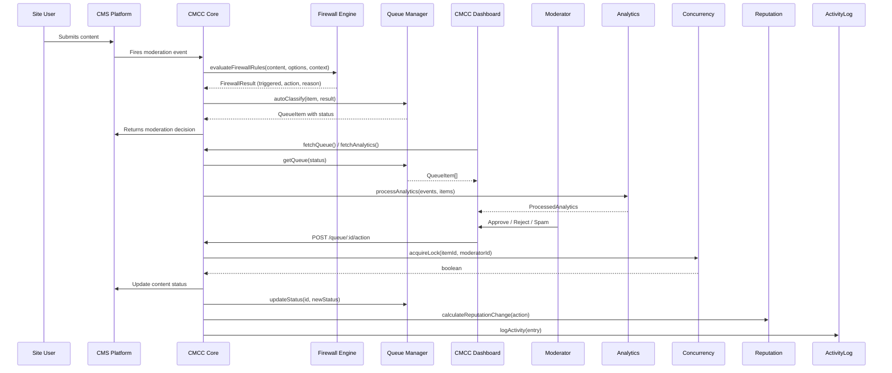

# CMCC — Content Moderation Command Center Developer Guide

> **Version:** 1.0.0  
> **Monorepo:** Turborepo + npm workspaces  
> **Last updated:** 2026-06-07

---

## Table of Contents

1. [Project Overview](#1-project-overview)
2. [Getting Started](#2-getting-started)
3. [Package: @cmcc/core](#3-package-cmccore)
   - [Analytics Engine](#analytics-srcanalyticsindexts)
   - [Concurrency Control](#concurrency-srcconcurrencyts)
   - [Firewall Rule Engine](#firewall-srcfirewallrulests)
   - [Queue Processor](#queues-srcqueuesindexts)
   - [Reputation System](#reputation-srcreputationindexts)
4. [Package: @cmcc/ui](#4-package-cmccui)
   - [HeatmapChart](#heatmapchart-componentsanalyticsheatmapcharttsx)
   - [QueueTable](#queuetable-componentsqueuequeuetabletsx)
   - [ActionButton](#actionbutton-componentscommonactionbuttontsx)
   - [NotificationBadge](#notificationbadge-componentscommonnotificationbadgetsx)
   - [SettingsForm](#settingsform-componentssettingssettingsformtsx)
5. [Platform: WordPress](#5-platform-wordpress)
6. [Platform: Strapi](#6-platform-strapi)
7. [Platform: Storyblok](#7-platform-storyblok)
8. [Platform: Wix](#8-platform-wix)
9. [Platform: Shopify](#9-platform-shopify)
10. [Shared Data Flow](#10-shared-data-flow)
11. [Testing Strategy](#11-testing-strategy)
12. [Code Style & Conventions](#12-code-style--conventions)
13. [Build & Deploy](#13-build--deploy)

---

## 1. Project Overview

### What Is CMCC?

CMCC (Content Moderation Command Center) is a multi-platform content moderation system that provides a unified dashboard for moderating user-generated content across different CMS platforms. It combines queue management, spam detection via a firewall rule engine, real-time analytics, user reputation scoring, and concurrency control in a single, extensible architecture.

**Supported platforms:**

| Platform | Integration Type | Language |
|----------|----------------|----------|
| WordPress | Native PHP plugin with React UI | PHP + JSX |
| Strapi | Strapi plugin (server + admin) | JavaScript (Node) |
| Storyblok | Iframe app via SDK | JavaScript (Browser) |
| Wix | Dashboard iframe app | JavaScript (Browser) |
| Shopify | Embedded Polaris app | JavaScript (Browser) |

### Monorepo Architecture

```mermaid
graph TD
    CMCC[cmcc/] --> Packages
    CMCC --> Platforms
    Packages --> Core[@cmcc/core]
    Packages --> UI[@cmcc/ui]
    Core --> Analytics
    Core --> Firewall
    Core --> Queue
    Core --> Reputation
    Core --> Concurrency
    Platforms --> WP[wordpress/]
    Platforms --> Strapi[strapi/]
    Platforms --> Storyblok[storyblok/]
    Platforms --> Wix[wix/]
    Platforms --> Shopify[shopify/]
    WP --> CMCCPHP[cmcc.php]
    WP --> ReactApp[src/App.jsx]
    Strapi --> Server[server/]
    Strapi --> Admin[admin/src/]
```

The monorepo uses:

- **Turborepo** (`turbo.json`) — orchestrates build, test, dev, and lint tasks across all packages and platforms.
- **npm workspaces** — defined in the root `package.json` via the `"workspaces"` key covering `packages/*` and `platforms/*`.
- **Pipeline dependencies** — `build` depends on `^build` (upstream builds complete first); `test` depends on `^build` (tested code must be built first).

### Technology Stack

| Layer | Technology |
|-------|-----------|
| Language | TypeScript 5.x (strict mode), PHP 8.x (WordPress) |
| UI Framework | React 18 |
| Build | Turborepo, Webpack 5, tsc, Babel |
| Testing | Jest 29, ts-jest, @testing-library/react |
| Linting | ESLint 9 (flat config), Prettier 3 |
| Package Manager | npm 11+ |
| Runtime | Node 24+ |

---

## 2. Getting Started

### Prerequisites

- **Node.js** v24 or later
- **npm** 11 or later
- **PHP** 8.0+ (only required for WordPress platform development)
- **Composer** (only if developing WordPress platform with PHP dependencies)

### Clone and Install

```bash
git clone <repository-url> cmcc
cd cmcc
npm install --legacy-peer-deps
```

> `--legacy-peer-deps` is required because several platform packages declare React 18 as both a `peerDependency` and a `devDependency`, which newer npm versions treat as a conflict.

### Build All Packages

```bash
npm run build
# Internally: turbo run build
```

This runs `build` scripts in dependency order:
1. `@cmcc/core` — compiled by `tsc` to `packages/cmcc-core/dist/`
2. `@cmcc/ui` — compiled by `tsc` to `packages/cmcc-ui/dist/`
3. WordPress plugin — bundled by Webpack to `platforms/wordpress/dist/`

### Run All Tests

```bash
npm test
# Internally: turbo run test
```

### Development Workflow

```bash
npm run dev
# Internally: turbo run dev --parallel
```

Starts TypeScript watch mode for `@cmcc/core` and `@cmcc/ui`, and Webpack watch mode for the WordPress platform, all in parallel.

### Linting & Formatting

```bash
npm run lint          # Turbo-based lint for all workspaces
npm run lint:eslint   # Root-level ESLint check
npm run lint:fix      # Auto-fix ESLint issues
npm run format        # Prettier check
npm run format:fix    # Auto-format
```

---

## 3. Package: @cmcc/core

**Location:** `packages/cmcc-core/`  
**npm name:** `@cmcc/core`  
**Entry:** `src/index.ts` (barrel re-exporting all submodules)  
**Build:** `tsc` → output to `dist/`

### Analytics (`src/analytics/index.ts`)

The analytics engine processes moderation events to produce dashboard insights: heatmaps, spam ratios, content breakdowns, moderator performance, anomaly alerts, activity log filtering, and trend analysis.

#### Core Data Types

```typescript
interface ModerationEvent {
  id: string | number
  timestamp: string          // ISO date string
  contentType: string
  action: string
  itemId: string | number
  userId: string | number
  blogId?: string | number
  moderatorId?: string | number
}

interface QueueItem {
  id: string
  contentType: string
  originalId: string | number
  status: 'pending' | 'spam' | 'flagged'
  spamScore: number
  authorId: string | number
  dateGmt: string            // ISO date string
  title: string
  excerpt: string
}

interface ProcessedAnalytics {
  heatmap: HeatmapData
  spamRatio: SpamRatioData
  contentTypeBreakdown: ContentTypeBreakdown[]
  moderatorPerformance: ModeratorPerformance[]
  anomalyAlerts: AnomalyAlert[]
  dateRange: { start: string; end: string }
}

interface AnalyticsOptions {
  heatmapLookbackDays: number
  anomalyThresholds: {
    queueVolumePerHour: number
    spamRatio: number
    moderatorActionsPerHour: number
  }
}

interface HeatmapData {
  data: number[][]       // 7 rows (days 0-6) × 24 columns (hours 0-23)
  maxCount: number
}

interface SpamRatioData {
  spamCount: number
  totalCount: number
  ratio: number
  percentage: number
}

interface ContentTypeBreakdown {
  contentType: string
  count: number
  percentage: number
}

interface ModeratorPerformance {
  moderatorId: string | number
  moderatorName: string
  approvals: number
  trashes: number
  spamCount: number
  totalActions: number
}

interface AnomalyAlert {
  id: string
  type: 'queue_volume' | 'spam_ratio' | 'moderator_activity'
  severity: 'low' | 'medium' | 'high'
  description: string
  timestamp: string
  value: number
  threshold: number
}
```

#### Helper Types (v1 Enhancements)

```typescript
interface ActivityLogEntry {
  id: string
  timestamp: string
  moderatorId: string | number
  moderatorName?: string
  action: 'approved' | 'rejected' | 'spammed' | 'trashed' | 'flagged'
        | 'deactivated' | 'deferred'
  contentType: string
  itemId: string | number
  itemTitle?: string
  previousStatus?: string
  newStatus?: string
  notes?: string
}

interface ActivityLogFilter {
  moderatorIds?: (string | number)[]
  actions?: ActivityLogEntry['action'][]
  contentTypes?: string[]
  dateFrom?: string
  dateTo?: string
  search?: string
  limit?: number
  offset?: number
}

interface TrendData {
  currentValue: number
  previousValue: number
  change: number
  percentageChange: number
  direction: 'up' | 'down' | 'stable'
}
```

#### Key Functions

---

##### `generateHeatmapData(events, options?)`

```typescript
function generateHeatmapData(
  events: ModerationEvent[],
  options?: Pick<AnalyticsOptions, 'heatmapLookbackDays'>,
): HeatmapData
```

**Purpose:** Creates a 7-day × 24-hour grid counting pending and spam content created within the lookback window.

**Parameters:**
- `events` — Array of all moderation events.
- `options.heatmapLookbackDays` — How many days back to analyze (default: 30).

**Execution flow:**
1. Initialize a 7×24 grid filled with zeros.
2. Calculate cutoff time from `now - lookbackDays`.
3. Iterate events, filtering to those within the lookback window where `action === 'created'` and `contentType` is `'comment'` or `'post'`.
4. Increment the cell at `[dayOfWeek][hour]`, tracking `maxCount`.
5. Return `{ data, maxCount }`.

**Returns:** A `HeatmapData` object.

---

##### `calculateSpamRatio(events, anomalyThresholds?)`

```typescript
function calculateSpamRatio(
  events: ModerationEvent[],
  options?: Pick<AnalyticsOptions, 'anomalyThresholds'>,
): SpamRatioData
```

**Purpose:** Computes the ratio of spam actions to total moderation actions in the last hour.

**Parameters:**
- `events` — Moderation events.
- `options.anomalyThresholds` — Threshold configuration (used for consistency but only ratio is returned).

**Execution flow:**
1. Filter events in the last hour.
2. Count `spammed` actions (spamCount) and `approved`/`spammed`/`trashed` actions (totalCount) for comments/posts.
3. Compute `ratio = spamCount / totalCount` (0 when totalCount is 0).
4. Return counts, ratio, and rounded percentage.

---

##### `generateContentTypeBreakdown(items)`

```typescript
function generateContentTypeBreakdown(
  items: QueueItem[],
): ContentTypeBreakdown[]
```

**Purpose:** Tallies queue items by content type, computing percentage of total.

**Execution flow:**
1. Count items grouped by `contentType`.
2. Convert to array with percentages, sorted descending by count.

---

##### `generateModeratorPerformance(events, moderatorNames?)`

```typescript
function generateModeratorPerformance(
  events: ModerationEvent[],
  moderatorNames?: Record<string | number, string>,
): ModeratorPerformance[]
```

**Purpose:** Computes per-moderator action counts for the past week.

**Execution flow:**
1. Filter events to the last 7 days that have a `moderatorId`.
2. Count `approved`, `trashed`, `spammed` actions per moderator.
3. Map to `ModeratorPerformance[]` sorted by total actions descending.
4. Unknown moderators get the label `"Moderator {id}"`.

---

##### `detectAnomalies(events, queueItems, options?)`

```typescript
function detectAnomalies(
  events: ModerationEvent[],
  queueItems: QueueItem[],
  options?: Pick<AnalyticsOptions, 'anomalyThresholds'>,
): AnomalyAlert[]
```

**Purpose:** Detects three types of anomalies in the last hour:
1. **Queue volume** — Unusually high number of pending/spam item creations.
2. **Spam ratio** — Spam ratio exceeding threshold (default 50%).
3. **Moderator activity** — A single moderator performing too many actions.

**Severity:** `'high'` when value exceeds 2× threshold, otherwise `'medium'`.

**Execution flow:**
1. Count recent creations; if above `queueVolumeThreshold`, create alert.
2. Call `calculateSpamRatio`; if ratio above `spamRatioThreshold`, create alert.
3. Count actions per moderator; any above `moderatorActivityThreshold` gets an alert.

---

##### `processAnalytics(events, queueItems, moderatorNames?, options?)`

```typescript
function processAnalytics(
  events: ModerationEvent[],
  queueItems: QueueItem[],
  moderatorNames?: Record<string | number, string>,
  options?: Partial<AnalyticsOptions>,
): ProcessedAnalytics
```

**Purpose:** Master function that runs all analytics in one call. Merges provided options with defaults, runs each sub-analysis, computes date range from events, and returns a complete `ProcessedAnalytics` object.

**Usage example:**

```typescript
import { processAnalytics } from '@cmcc/core'

const analytics = processAnalytics(events, queueItems, {
  1: 'Alice',
  2: 'Bob',
})
```

##### `filterActivityLog(entries, filter)`

```typescript
function filterActivityLog(
  entries: ActivityLogEntry[],
  filter?: ActivityLogFilter,
): ActivityLogEntry[]
```

**Purpose:** Filters, sorts (newest first), and paginates activity log entries. All filter fields are optional. Supports searching across `itemTitle`, `moderatorName`, and `notes`.

---

##### `calculateTrend(events, predicate, currentPeriodStart, ...)`

```typescript
function calculateTrend(
  events: ModerationEvent[],
  predicate: (event: ModerationEvent) => boolean,
  currentPeriodStart: string,
  currentPeriodEnd?: string,
  previousPeriodDuration?: number,
): TrendData
```

**Purpose:** Period-over-period comparison. Counts events matching `predicate` in the current period and the previous period (same duration, immediately preceding). Returns absolute change, percentage change, and direction (`'up'` / `'down'` / `'stable'` within ±5%).

---

##### `getDateRangeForPeriod(period)`

```typescript
function getDateRangeForPeriod(
  period: 'today' | 'yesterday' | 'last7days' | 'last30days' | 'last90days' | 'all',
): { start: string; end: string }
```

**Purpose:** Convenience helper returning ISO date range bounds for common time periods. `'yesterday'` returns a closed range for just that day; `'all'` starts at Unix epoch.

---

#### Helper Functions

```typescript
function getDefaultAnalyticsOptions(): AnalyticsOptions
function getEmptyAnalytics(): ProcessedAnalytics
```

`getEmptyAnalytics()` returns a zeroed-out state for initial loading / empty states in the UI.

---

### Concurrency (`src/concurrency.ts`)

Prevents multiple moderators from acting on the same queue item simultaneously. This is an in-memory implementation; production deployments should replace it with a distributed store (Redis, etc.).

#### Interfaces

```typescript
interface LockInfo {
  lockedBy: string | null       // moderator ID
  expiresAt: number | null      // timestamp in milliseconds
}

interface LockManagerStats {
  totalAcquisitions: number
  totalReleases: number
  totalRejections: number
  totalTimeouts: number
  activeLocks: number
}

interface ConcurrencyOptions {
  defaultLockTimeout?: number         // seconds, default 30
  cleanupIntervalSeconds?: number     // default 60
}
```

#### `InMemoryLockManager` Class

```typescript
class InMemoryLockManager {
  constructor(options?: ConcurrencyOptions)
```

**Internal state:** A `Map<string, { moderatorId, expiresAt }>` of active locks, a stats accumulator, and a cleanup interval timer.

**Methods:**

| Method | Signature | Description |
|--------|-----------|-------------|
| `acquireLock` | `(itemId, moderatorId, lockTimeoutSeconds?) => boolean` | Acquires a lock. Returns `true` if successful. If same moderator re-acquires, the lock expiry is extended. If held by another moderator (not expired), returns `false`. Expired locks are overwritten. |
| `releaseLock` | `(itemId, moderatorId) => boolean` | Releases a lock only if `moderatorId` matches the holder. Returns `false` if no lock or wrong holder. |
| `getLockInfo` | `(itemId) => LockInfo` | Returns lock status. Automatically cleans up expired locks on read. |
| `forceReleaseLock` | `(itemId) => boolean` | Admin override — releases regardless of holder. |
| `getActiveLocks` | `() => LockInfo[]` | Returns all non-expired locks. |
| `getStats` | `() => LockManagerStats` | Returns cumulative statistics. |
| `clearAllLocks` | `() => void` | Clears all locks (useful for testing). |
| `stop` | `() => void` | Clears the cleanup interval timer. Call when shutting down. |

**Internal cleanup flow:**

```
setInterval(cleanupExpiredLocks, cleanupIntervalSeconds * 1000)
    │
    └── For each lock where expiresAt <= now:
          → delete from map
          → increment stats.totalTimeouts
```

**Factory function:**

```typescript
function getDefaultLockManager(): InMemoryLockManager
```

---

### Firewall (`src/firewall/rules.ts`)

A platform-agnostic rule engine that evaluates content against configurable spam firewall rules. Results determine whether content is flagged, discarded, or marked as spam.

#### Interfaces

```typescript
interface FirewallRuleOptions {
  maxLinks?: number
  blacklistedKeywords?: string[]
  blacklistedIPs?: string[]
  blacklistedEmailDomains?: string[]
  blockedCountries?: string[]           // ISO country codes
  minSubmitTime?: number                // seconds
  enableDuplicateDetection?: boolean
  duplicateLookbackDays?: number
  duplicateThreshold?: number           // max Hamming distance for simhash (default: 3)
  globalAction?: 'flag' | 'discard' | 'spam'
  ruleActions?: Record<string, 'flag' | 'discard' | 'spam'>
}

interface FirewallResult {
  triggered: boolean
  action: 'flag' | 'discard' | 'spam' | null
  reason: string
  ruleName: string
}
```

#### Rule Functions

All individual rule checkers return `{ triggered, ...data }` objects.

| Function | Signature | Description |
|----------|-----------|-------------|
| `simhash` | `(content: string) => string` | Computes a 64-bit simhash as a hex string. Tokenizes by non-alphanumeric characters, hashes each token with a BigInt polynomial hash (h = h×31 + charCode), aggregates bit vectors, and produces the final 64-bit fingerprint. |
| `checkLinkCount` | `(content, maxLinks?) => { triggered, count }` | Counts `https?://` URLs in content via regex. Default max: 3. |
| `checkBlacklistedKeywords` | `(content, keywords?) => { triggered, matchedKeyword }` | Case-insensitive matching with wildcard support: `*keyword*` (contains), `keyword*` (starts with), `*keyword` (ends with), plain (contains). |
| `checkBlacklistedIP` | `(ip, blacklistedIPs?) => { triggered, matchedIP }` | Supports exact IP and CIDR notation (e.g., `192.168.1.0/24`). Uses `isIPInCIDRRange` helper. |
| `checkBlacklistedEmailDomain` | `(email, domains?) => { triggered, matchedDomain }` | Extracts domain after `@`, compares case-insensitively. |
| `checkBlockedCountry` | `(countryCode, blockedCountries?) => { triggered, matchedCountry }` | Case-insensitive ISO country code comparison. |
| `checkSubmitTime` | `(timeDelta, minTime?) => { triggered, timeDelta }` | Honeypot / fast-submit detection. Default minimum: 5 seconds. |
| `checkDuplicateContent` | `(contentHash, recentHashes?, threshold?) => { triggered, isDuplicate }` | Compares simhash against a set of recent hashes using Hamming distance. Default threshold: 3. |

**Helper:** `isIPInCIDRRange(ip: string, cidr: string): boolean` — converts dotted-quad to 32-bit integer, applies CIDR mask, and compares.

#### Master Evaluation

```typescript
function evaluateFirewallRules(
  content: string,
  options?: FirewallRuleOptions,
  context?: {
    authorIP?: string
    authorEmail?: string
    submitTimeDelta?: number
    contentHash?: string
    recentHashes?: Set<string>
    countryCode?: string
  },
): FirewallResult
```

**Evaluation order (priority):**

1. **Link count** (`maxLinks`) → default action: `flag`
2. **Blacklisted keywords** (`blacklistedKeywords`) → default action: `discard`
3. **Blacklisted IP** (`blacklistedIPs`) → default action: `discard`
4. **Blacklisted email domain** (`blacklistedEmailDomains`) → default action: `discard`
5. **Blocked country** (`blockedCountries`) → default action: `discard`
6. **Submit time** (`submitTime`) → default action: `discard`
7. **Duplicate content** (`duplicateContent`) → default action: `flag`

Rules are short-circuited — the first triggered rule immediately returns with its resolved action. Action resolution priority:
1. Per-rule override in `ruleActions[ruleName]`
2. Global `globalAction`
3. Hard-coded per-rule default (as listed above)

#### Stats Tracking

```typescript
function getFirewallRuleStats(): FirewallRuleStats
function resetFirewallRuleStats(): void
```

Internal `ruleStatsMap` counts how many times each rule name was triggered. Useful for monitoring and tuning.

#### Default Configuration

```typescript
function getDefaultFirewallOptions(): FirewallRuleOptions
// Returns: { maxLinks: 3, blacklistedKeywords: [], blacklistedIPs: [],
//            blacklistedEmailDomains: [], blockedCountries: [],
//            minSubmitTime: 5, enableDuplicateDetection: true,
//            duplicateLookbackDays: 30, duplicateThreshold: 3 }
```

---

### Queues (`src/queues/index.ts`)

In-memory queue management for the moderation workflow. Provides enqueue/dequeue, status tracking, stats, and automatic classification based on firewall results.

#### Interface

```typescript
interface QueueStats {
  pending: number
  spam: number
  flagged: number
  total: number
}
```

#### `QueueManager` Class

```typescript
class QueueManager {
  private queue: QueueItem[] = []
```

| Method | Signature | Description |
|--------|-----------|-------------|
| `enqueue` | `(item) => void` | Adds item to end of queue. |
| `dequeue` | `() => QueueItem \| undefined` | Removes and returns first item. |
| `peek` | `() => QueueItem \| undefined` | Returns first item without removing. |
| `updateStatus` | `(id, newStatus) => boolean` | Finds by ID and updates status. Returns `false` if not found. |
| `remove` | `(id) => boolean` | Removes item by ID. Returns `false` if not found. |
| `getQueue` | `(status?) => QueueItem[]` | Returns shallow copy, optionally filtered by status. |
| `getQueueStats` | `() => QueueStats` | Returns counts of pending/spam/flagged/total. |
| `processNext` | `<T>(callback) => T \| undefined` | Dequeues and passes item to callback. Returns callback result or `undefined`. |
| `autoClassify` | `(item, firewallResult) => QueueItem` | Returns a new item with status set based on firewall action: `'spam'` → `'spam'`, `'flag'` → `'flagged'`, `'discard'` → `'spam'`, not triggered → `'pending'`. |

---

### Reputation (`src/reputation/index.ts`)

User reputation scoring system with score decay, breach tracking, risk level classification, and a storage adapter interface.

#### Interfaces

```typescript
interface ReputationScore {
  score: number
  lastUpdated: string           // ISO date
  totalApproved: number
  totalRejected: number
  timesDeactivated: number
}

interface BreachRecord {
  id: string
  userId: string | number
  timestamp: string
  reason: string
  moderatorId: string | number
  contentType: string
  contentId: string | number
}

interface ReputationOptions {
  approvedItemScore: number         // default: 1
  rejectedItemScore: number         // default: -2
  deactivationScore: number         // default: -10
  decayEnabled: boolean             // default: true
  decayRatePerPeriod: number        // default: 1
  decayPeriodDays: number           // default: 7
  inactivityThresholdDays: number   // default: 30
}

type RiskLevel = 'low' | 'medium' | 'high' | 'critical'

interface RiskLevelThresholds {
  criticalScoreThreshold: number    // default: -10
  highRiskScoreThreshold: number    // default: -5
  mediumRiskScoreThreshold: number  // default: -2
  criticalBreachThreshold: number   // default: 6
  highBreachThreshold: number       // default: 3
  mediumBreachThreshold: number     // default: 1
}

interface BreachFrequency {
  totalBreaches: number
  breachesPerDay: number
  periodDays: number
  byReason: Record<string, number>
}

interface UserReputationSummary {
  currentScore: number
  riskLevel: RiskLevel
  recentBreachCount: number
  breachFrequency: BreachFrequency
  totalApproved: number
  totalRejected: number
  timesDeactivated: number
  lastUpdated: string | null
}
```

#### Key Functions

| Function | Signature | Description |
|----------|-----------|-------------|
| `calculateReputationChange` | `(action, options) => number` | Returns score delta: `'approve'` → +1, `'reject'`/`'spam'` → -2, `'deactivate'` → -10 (default values). |
| `calculateDecayedScore` | `(currentScore, lastActivityDate, currentDate, options) => number` | Applies decay toward zero if inactivity exceeds `inactivityThresholdDays`. Each `decayPeriodDays` of additional inactivity subtracts `decayRatePerPeriod`. Positive scores decay downward, negative scores decay upward. |
| `isHighRiskUser` | `(score, recentBreachCount, options) => boolean` | Returns `true` if score ≤ `highRiskThreshold` (-5) OR breaches ≥ `recentBreachThreshold` (3). |
| `classifyRiskLevel` | `(score, recentBreachCount, thresholds?) => RiskLevel` | Classifies user into `critical`/`high`/`medium`/`low` using score and breach thresholds. Critical overrides all. |
| `calculateBreachFrequency` | `(breaches, periodDays?) => BreachFrequency` | Returns total breaches, breaches per day, and breakdown by reason. |
| `generateUserReputationSummary` | `(score, breaches, options?, riskThresholds?, breachLookbackDays?) => UserReputationSummary` | Combines all reputation data into a single comprehensive summary. |

#### Storage Adapter

```typescript
interface ReputationStorageAdapter {
  getReputationScore(userId): Promise<ReputationScore | null>
  saveReputationScore(userId, score): Promise<void>
  getUserBreaches(userId, limit?): Promise<BreachRecord[]>
  addBreachRecord(breach): Promise<string>      // returns breach ID
  clearOldBreachRecords(beforeDate): Promise<void>
}
```

**`InMemoryReputationAdapter`** — A Map-based implementation for testing and demo purposes. Stores scores and breaches in-memory with auto-incrementing breach IDs. Not suitable for production multi-server environments.

**Default helpers:**

```typescript
function getDefaultReputationOptions(): ReputationOptions
function getDefaultHighRiskThresholds(): { highRiskThreshold, recentBreachThreshold }
function getDefaultRiskLevelThresholds(): RiskLevelThresholds
```

### AI-Powered Moderation (`src/ai/index.ts`) — *New in v1.0.0*

Types, interfaces, and adapters for AI-powered content classification, language detection, sentiment analysis, and image moderation. Supports three cloud providers and a built-in local engine.

```typescript
export type AiDetectionEngine = 'none' | 'local' | 'openai' | 'claude' | 'gemini' | 'custom'

interface AiEngineConfig {
  engine: AiDetectionEngine
  apiEndpoint?: string
  apiKey?: string
  model?: string
  maxContentLength?: number  // default: 5000
  timeoutMs?: number         // default: 30000
}
```

**Available Adapters:**

| Adapter | Engine | Provider | API Auth | Endpoint |
|---------|--------|----------|----------|----------|
| `OpenAiAdapter` | `'openai'` | OpenAI | `Authorization: Bearer` | `api.openai.com/v1` |
| `ClaudeAdapter` | `'claude'` | Anthropic | `x-api-key` | `api.anthropic.com/v1` |
| `GeminiAdapter` | `'gemini'` | Google | `x-goog-api-key` | `generativelanguage.googleapis.com/v1beta` |
| `LocalAiAdapter` | `'local'` | Built-in | None | Runs offline |

**Model Registry (`src/ai/model-registry.ts`):**

Dynamically fetches available model lists from each provider's API (`GET /v1/models` for OpenAI/Anthropic, `GET /v1beta/models` for Gemini). Falls back to built-in lists when the API is unreachable. Results are cached for 5 minutes.

```typescript
// Fetch available models for a provider
fetchAvailableModels(engine: 'openai' | 'claude' | 'gemini', apiKey?, apiEndpoint?) => Promise<AiModelInfo[]>

// Get the default model ID for a provider
getDefaultModelId(engine, apiKey?, apiEndpoint?) => Promise<string>

// Check if a model ID belongs to a provider
isModelCompatible(modelId, engine) => boolean
```

**Keyword Registry (`src/ai/keyword-registry.ts`):**

Manages spam detection keywords and profanity lists with remote API fallback support.

```typescript
getSpamKeywords(apiEndpoint?) => Promise<readonly string[]>
getProfanityList(apiEndpoint?) => Promise<readonly string[]>
containsProfanity(text) => boolean
```

### Configuration Registries (`src/config/`)

**Options Registry:** Centralized select option lists for all platforms. Timezones and locales are generated dynamically from `Intl` APIs to stay in sync with IANA / Unicode databases.

```typescript
getTimezoneOptions() => SelectOption[]      // 400+ IANA zones via Intl.supportedValuesOf
getLocaleOptions() => SelectOption[]         // Generated via Intl.DisplayNames
getAiEngineOptions() => SelectOption[]       // All 6 engines
getModerationBehaviors() => SelectOption[]   // flag, spam, discard
```

**Platform Registry:** Single source of truth for all 5 platform definitions.

```typescript
getPlatforms() => PlatformDefinition[]
getPlatform(id) => PlatformDefinition | undefined
```

### Return Types

```typescript
interface AiSpamScore {
  score: number              // 0-100
  confidence: number         // 0-1
  reason: string
  factors: AiScoringFactor[]
}

interface LanguageDetection {
  language: string           // ISO 639-1
  confidence: number         // 0-1
  languageName: string
}

interface SentimentAnalysis {
  sentiment: 'positive' | 'negative' | 'neutral' | 'mixed'
  score: number              // -1 to 1
  confidence: number         // 0-1
  toxicityScore: number      // 0-1
  isToxic: boolean
  toxicCategories: string[]
}

interface ImageModerationResult {
  isSafe: boolean
  confidence: number
  categories: ImageModerationCategory[]
  suggestedAction: 'approve' | 'flag' | 'reject'
}

interface AiModerationResult {
  id: string
  contentPreview: string
  spamScore: AiSpamScore
  language?: LanguageDetection
  sentiment?: SentimentAnalysis
  imageModeration?: ImageModerationResult
  recommendedAction: 'approve' | 'flag' | 'spam' | 'discard'
  analyzedAt: string
  engine: AiDetectionEngine
  processingTimeMs: number
}
```

**Provider Adapter Interface:**

```typescript
interface AiProviderAdapter {
  name: string
  isConfigured(): boolean
  classifySpam(content, context?): Promise<AiSpamScore>
  detectLanguage(text): Promise<LanguageDetection>
  analyzeSentiment(text): Promise<SentimentAnalysis>
  moderateImage(imageUrl): Promise<ImageModerationResult>
  moderateContent(content, options?): Promise<AiModerationResult>
  learnFromFeedback(content, moderatorAction, aiAction): Promise<void>
}
```

Implement `AiProviderAdapter` to add new provider integrations.

**Pattern Learning:**

```typescript
interface LearnedPattern {
  id: string
  type: 'keyword' | 'pattern' | 'behavior' | 'source'
  value: string
  weight: number
  confidence: number          // 0-1
  observationCount: number
  suggestedAction: 'flag' | 'spam' | 'approve'
  feedbackScore: number       // -1 to 1
}
```

### Collaboration (`src/collaboration/index.ts`) — *New in v1.0.0*

Collaboration features including moderation notes, team management, approval workflows, activity feeds, conflict detection, and item assignment (Section 10.6).

```typescript
interface ModerationNote {
  id: string
  itemId: string
  authorId: string | number
  authorName: string
  content: string
  createdAt: string
  updatedAt?: string
  isInternal: boolean
  type: 'general' | 'question' | 'instruction' | 'resolution'
}

interface ModerationTeam {
  id: string
  name: string
  description: string
  members: TeamMember[]
  permissions: TeamPermissions
  createdAt: string
  isActive: boolean
}

interface ItemAssignment {
  itemId: string
  assigneeId?: string | number
  teamId?: string
  assignedById: string | number
  assignedAt: string
  dueDate?: string
  status: 'pending' | 'in_progress' | 'completed' | 'overdue'
  priority: 'low' | 'normal' | 'high' | 'critical'
}

interface ApprovalWorkflow {
  id: string
  name: string
  contentTypes: string[]
  steps: ApprovalStep[]
  triggers: WorkflowTrigger[]
  isActive: boolean
}

interface ActivityFeedEvent {
  id: string
  type: 'action' | 'note' | 'assignment' | 'escalation' | 'team_change'
  actorId: string | number
  actorName: string
  description: string
  itemId?: string
  itemTitle?: string
  timestamp: string
}
```

**Helper functions:**
- `getDefaultTeamPermissions()` — Returns default permissions for a new team
- `getRolePermissions(role)` — Returns permissions for a given team role (`lead`, `senior`, `moderator`, `trainee`)

### SLA & Escalation (`src/sla/index.ts`) — *New in v1.0.0*

SLA/deadline tracking and escalation workflows for advanced queue management (Section 10.1).

```typescript
interface SlaTarget {
  contentType: string
  priority: 'low' | 'normal' | 'high' | 'critical'
  maxResponseTimeHours: number
  sendReminders: boolean
  reminderFrequencyHours: number
  autoEscalate: boolean
}

interface SlaConfig {
  enabled: boolean
  targets: SlaTarget[]
  defaultMaxResponseTimeHours: number  // default: 24
  businessHoursOnly: boolean           // default: true
  businessHoursStart: number           // default: 9
  businessHoursEnd: number             // default: 17
  businessDays: number[]               // default: [1,2,3,4,5]
}

interface EscalationRule {
  name: string
  condition: 'spam_score' | 'unreviewed_time' | 'author_reputation' | 'keyword_match'
  operator: '>' | '<' | '>=' | '<=' | '==' | 'contains'
  threshold: number | string
  escalateToLevel: 'warning' | 'breach' | 'critical'
  assignTo?: string | number
  active: boolean
}
```

**Default helpers:**
- `getDefaultSlaConfig()` — Returns SLA configuration with all defaults
- `getDefaultEscalationRules()` — Returns 4 default escalation rules (high spam score, 24h unreviewed, 72h unreviewed, bad actor)

---

## 4. Package: @cmcc/ui

**Location:** `packages/cmcc-ui/`  
**npm name:** `@cmcc/ui`  
**Entry:** `src/index.ts` (barrel exports)  
**Peer dependencies:** `react@^18`, `react-dom@^18`

All components use CSS class names prefixed with `cmcc-` to avoid style conflicts. They are "headless" in the sense that they accept data and callbacks as props and render inline styles + class names — no external CSS import required.

### HeatmapChart (`components/analytics/HeatmapChart.tsx`)

```typescript
interface HeatmapChartProps {
  data: HeatmapData              // from @cmcc/core
  theme?: Record<string, unknown>
  onCellClick?: (dayOfWeek: number, hour: number, count: number) => void
  showTooltip?: boolean          // default: true
}
```

**Internal details:**
- **DAY_LABELS** = `['Sun', 'Mon', 'Tue', 'Wed', 'Thu', 'Fri', 'Sat']`
- **HOUR_LABELS** = `['0:00', '1:00', ..., '23:00']`
- **Color calculation:** Linear blue gradient — `rgb(200, 230, {180 + intensity * 75})`. When `maxCount === 0`, cells render as `#f0f0f1`.
- **Tooltip format:** `"{Day} {Hour}:00: {count} items"`
- **Layout:** Hour labels row → Grid (day labels + cells) → Legend bar (Low → High)
- **Empty state:** Renders "No data available" when data is missing or empty.

### QueueTable (`components/queue/QueueTable.tsx`)

```typescript
interface QueueTableProps {
  items: QueueItem[]
  onBulkAction: (actionType: string, selectedIds: string[]) => void
  onItemAction: (actionType: string, itemId: string) => void
  filters: {
    contentType: string
    status: string
    dateRange: string
    search: string
  }
  onFilterChange: (newFilters: Partial<{...}>) => void
  isLoading?: boolean
  totalCount?: number
  theme?: Record<string, unknown>
}
```

**Internal details:**
- **CONTENT_TYPE_ICONS** — Maps content types to emoji icons:
  - `comment`, `bbpress_topic`, `bbpress_reply` → 💬
  - `post` → 📝, `page` → 📄, `media` → 🖼️, `user` → 👤
  - `form_entry` → 📋, `woocommerce_review` → 🛒
  - `buddypress_activity`, `buddypress_group_post` → 👥
  - `default` → 📄
- **STATUS_CONFIG** — Color-coded badges:
  - `pending` → yellow `#ffc107`, `spam` → red `#dc3545`, `flagged` → orange `#fd7e14`
- **Columns:** checkbox, Type (icon), Title/Excerpt, Author, Date, Status (colored badge), Spam Score, Actions (Approve / Reject / Spam / Defer buttons).
- **Bulk actions:** `approve-all`, `move-to-trash`, `mark-as-spam`, `deactivate-users`, `export-csv`.
- **States:** Loading spinner, empty message ("No items match your filters"), pagination info.

### ActionButton (`components/common/ActionButton.tsx`)

```typescript
interface ActionButtonProps {
  variant: 'primary' | 'secondary' | 'danger' | 'ghost'
  size: 'sm' | 'md' | 'lg'
  icon?: React.ReactNode
  iconPosition?: 'left' | 'right'     // default: 'left'
  loading?: boolean
  disabled?: boolean
  onClick?: () => void
  children: React.ReactNode
  className?: string
  type?: 'button' | 'submit'
}
```

**Variant styles (inline CSS):**

| Variant | Background | Text | Border |
|---------|-----------|------|--------|
| `primary` | `#2563eb` | white | `#2563eb` |
| `secondary` | `#6b7280` | white | `#6b7280` |
| `danger` | `#dc2626` | white | `#dc2626` |
| `ghost` | transparent | `#374151` | transparent |

**Loading state:** Injects a `@keyframes cmcc-spin` stylesheet once, renders a CSS spinner (rotating border) replacing the icon slot. Spinner size scales with button size (sm=12px, md=16px, lg=20px). The button is `disabled` and `aria-busy="true"` when loading.

### NotificationBadge (`components/common/NotificationBadge.tsx`)

```typescript
interface NotificationBadgeProps {
  count: number
  type: 'pending' | 'spam' | 'alert'
  onClick?: () => void
  size?: 'sm' | 'md'
  pulse?: boolean
}
```

**Type colors:**

| Type | Background | Text |
|------|-----------|------|
| `pending` | `#eab308` (yellow) | `#1c1917` |
| `spam` | `#dc2626` (red) | white |
| `alert` | `#ea580c` (orange) | white |

**Overflow:** Counts > 99 display as `"99+"`. Negative counts display as `"0"`.

**Pulse animation:** When `pulse` is true, injects a `@keyframes cmcc-badge-pulse` keyframe and applies a 1.5s infinite scale animation.

**Accessibility:** `role="status"` with `aria-label` describing the badge type and count.

### SettingsForm (`components/settings/SettingsForm.tsx`)

```typescript
interface SettingsField {
  name: string
  label: string
  type: 'text' | 'number' | 'select' | 'toggle' | 'textarea'
  placeholder?: string
  options?: { value: string; label: string }[]
  helpText?: string
  required?: boolean
}

interface SettingsSection {
  id: string
  title: string
  fields: SettingsField[]
}

interface SettingsFormProps {
  sections: SettingsSection[]
  onSubmit: (formData: Record<string, unknown>) => void
  initialValues: Record<string, unknown>
  validators: Record<string, (value: unknown) => string | null>
  submitLabel?: string             // default: 'Save Changes'
  isSubmitting?: boolean
}
```

**Features:**

- **Tabbed navigation** — `role="tablist"` with buttons for each section. Active tab has a blue bottom border (`#2563eb`). Inactive tabs are gray (`#6b7280`).
- **Inline validation** — Runs on blur per-field and on submit across all fields. Errors display as red (`#dc2626`) text with `role="alert"`. Invalid inputs get `aria-invalid="true"` and a red border.
- **Dirty detection** — Tracks which fields have been modified via a `Set<string>`. The Reset button is disabled when no fields are dirty.
- **Reset** — Restores `initialValues`, clears dirty and error state.
- **Required fields** — Marked with a red asterisk.
- **Render per type:** Text/number inputs, select dropdowns, textareas, and toggle checkboxes each have their own styled rendering branch.
- **Empty state:** Displays "No settings sections available" when sections array is empty.

### QuickFilterBar (`components/queue/QuickFilterBar/index.tsx`) — *New in v1.0.0*

One-click preset filters for the moderation queue (Section 8 - Design Modernization).

```typescript
interface QuickPreset {
  id: string
  label: string
  icon?: string
  filters: Record<string, unknown>
}

interface QuickFilterBarProps {
  presets: QuickPreset[]    // default: 6 built-in presets
  activePreset?: string | null
  onSelectPreset: (presetId: string | null) => void
  className?: string
}
```

**Built-in presets:** Last Hour 🕐, Today 📅, This Week 📆, Pending Only ⏳, High Spam Score 🚫, Flagged ⚠️. Click a preset to apply, click again or "All" to clear.

### ProgressBar (`components/common/ProgressBar/index.tsx`) — *New in v1.0.0*

Flexible progress indicator for bulk operations and async tasks.

```typescript
interface ProgressBarProps {
  value: number
  max?: number             // default: 100
  label?: string
  showPercentage?: boolean // default: true
  size?: 'sm' | 'md' | 'lg'
  variant?: 'default' | 'success' | 'warning' | 'danger' | 'info'
  indeterminate?: boolean
}
```

**States:** Determinate (shown width based on `value/max`), Indeterminate (animated), optional label + percentage text. Supports 5 color variants and 3 sizes.

### ConfirmationModal (`components/common/ConfirmationModal/index.tsx`) — *New in v1.0.0*

Accessible confirmation dialog with destructive mode and undo support.

```typescript
interface ConfirmationModalProps {
  open: boolean
  title: string
  message: string | React.ReactNode
  confirmLabel?: string        // default: 'Confirm'
  cancelLabel?: string         // default: 'Cancel'
  confirmVariant?: 'primary' | 'danger' | 'warning'
  destructive?: boolean
  undoable?: boolean
  undoDurationSeconds?: number // default: 5
  onConfirm: () => void
  onCancel: () => void
  loading?: boolean
}
```

**Accessibility:** Uses `role="alertdialog"`, `aria-modal`, `aria-labelledby`, `aria-describedby`. Focus trap and Escape key handling. Shows spinner in confirm button during loading.

### ModerationNotes (`components/collaboration/ModerationNotes.tsx`) — *New in v1.0.0*

Collaboration notes for moderator communication on queue items (Section 10.6).

```typescript
interface ModerationNotesProps {
  notes: Note[]
  onAddNote: (content: string, isInternal: boolean, type: Note['type']) => void
  canAdd?: boolean               // default: true
  currentUserName?: string       // default: 'You'
  isLoading?: boolean
}
```

**Features:** 4 note types (General, Question, Instruction, Resolution), internal-only visibility toggle, newest-first ordering, empty state with helpful prompt.

### ActivityFeed (`components/collaboration/ActivityFeed.tsx`) — *New in v1.0.0*

Real-time moderation activity timeline (Section 10.6).

```typescript
interface ActivityFeedProps {
  events: FeedEvent[]
  isLoading?: boolean
  error?: string | null
  onRetry?: () => void
  title?: string                 // default: 'Activity Feed'
}
```

**Features:** 5 event types (action, note, assignment, escalation, team_change) with color-coded borders and icons. Shows relative timestamps ("2m ago", "1h ago"). Includes skeleton loading state and error state with retry.

---

## 5. Platform: WordPress

**Location:** `platforms/wordpress/`  
**Plugin file:** `cmcc.php`  
**React app:** `src/` (index.js, App.jsx, App.css)  
**Build:** Webpack 5 → `dist/cmcc-app.js` + `dist/cmcc-app.css`  

### Plugin Structure

```
wordpress/
├── cmcc.php                 # Plugin bootstrap, DB schema, REST API, admin pages
├── webpack.config.js        # Bundles React app for WP admin
├── src/
│   ├── index.js             # React entry point (renders <App /> into #cmcc-app)
│   ├── App.jsx              # Main app with tabs, API calls, component wiring
│   ├── App.css              # Scoped styles (prefixed with #cmcc-app)
│   └── __tests__/           # Platform-specific tests
└── dist/                    # Built assets (gitignored)
```

### Database Schema

Created on activation via `dbDelta()`.

**`wp_cmcc_queue`** — Moderation queue:

| Column | Type | Indexes |
|--------|------|---------|
| `id` | BIGINT UNSIGNED AUTO_INCREMENT PK | PRIMARY |
| `item_id` | VARCHAR(255) NOT NULL | INDEX |
| `content_type` | VARCHAR(100) NOT NULL | INDEX |
| `status` | VARCHAR(50), default 'pending' | INDEX |
| `spam_score` | FLOAT, default 0 | |
| `author_id` | VARCHAR(255) | |
| `date_gmt` | DATETIME | |
| `title` | TEXT | |
| `excerpt` | TEXT | |
| `created_at` | DATETIME, default CURRENT_TIMESTAMP | |

**`wp_cmcc_activity_log`** — Audit trail:

| Column | Type | Indexes |
|--------|------|---------|
| `id` | BIGINT UNSIGNED AUTO_INCREMENT PK | PRIMARY |
| `moderator_id` | VARCHAR(255) NOT NULL | INDEX |
| `action` | VARCHAR(100) NOT NULL | INDEX |
| `content_type` | VARCHAR(100) NOT NULL | |
| `item_id` | VARCHAR(255) NOT NULL | |
| `item_title` | TEXT | |
| `previous_status` | VARCHAR(50) | |
| `new_status` | VARCHAR(50) | |
| `notes` | TEXT | |
| `timestamp` | DATETIME, default CURRENT_TIMESTAMP | INDEX |

### REST API Endpoints

All routes are under the `cmcc/v1` namespace. Permission check: `manage_options` capability.

| Method | Route | Description | Parameters |
|--------|-------|-------------|------------|
| `GET` | `/cmcc/v1/queue` | Get paginated queue items | `page`, `per_page`, `status`, `content_type`, `search` |
| `POST` | `/cmcc/v1/queue/:id/action` | Moderate a single item | `action` (approve/reject/spam/defer), `notes` |
| `POST` | `/cmcc/v1/queue/bulk-action` | Bulk action on items | `ids` (array), `action` (approve-all/move-to-trash/mark-as-spam/deactivate-users/export-csv) |
| `GET` | `/cmcc/v1/analytics` | Queue stats, content breakdown, spam ratio, activity summary | — |
| `GET` | `/cmcc/v1/activity-log` | Paginated activity log | `page`, `per_page`, `action` |
| `GET` | `/cmcc/v1/settings` | Get plugin settings | — |
| `POST` | `/cmcc/v1/settings` | Update plugin settings | Settings payload |
| `GET` | `/cmcc/v1/queue/:id/history` | Get item history/timeline | `id` (item ID) |
| `GET` | `/cmcc/v1/users/reputation` | Get user reputation data | — |
| `POST` | `/cmcc/v1/settings/export` | Export settings as JSON | — |
| `POST` | `/cmcc/v1/settings/import` | Import settings from JSON | `settings` object |

### Admin Pages

Registered via `add_menu_page()` and `add_submenu_page()`:

- **CMCC** (top-level, icon: shield checkmark SVG) → Queue tab
- **Queue** (submenu, alias to top-level)
- **Analytics** (submenu, `cmcc-analytics`)
- **Settings** (submenu, `cmcc-settings`)

### React App Integration

The `cmcc_enqueue_app_assets()` function:
1. Enqueues the built CSS (`cmcc-app.css`) with `wp-components` dependency.
2. Enqueues the built JS (`cmcc-app.js`) with WordPress dependencies: `wp-api`, `wp-element`, `wp-i18n`, `wp-components`, `wp-hooks`.
3. Localizes `cmccData` with: `restUrl`, `nonce`, `userId`, `userDisplay`, `adminUrl`, `pluginUrl`, `initialTab`.

### Webpack Configuration

- **Entry:** `./src/index.js`
- **Output:** `dist/cmcc-app.js`
- **Externals:** React, ReactDOM, WordPress packages (`@wordpress/api-fetch`, `@wordpress/element`, etc.) — all loaded from WP's built-in scripts.
- **Loaders:** Babel (preset-env + preset-react with automatic JSX runtime), CSS via MiniCssExtractPlugin.
- **Mode:** Production or development based on `NODE_ENV`.

### App.jsx Key Implementation Details

The `App` component uses `@cmcc/core` for analytics processing (`getEmptyAnalytics`) and `@cmcc/ui` for all UI components. It:

- Reads `window.cmccData` for API base URL, nonce, user info, and initial tab.
- Implements a custom `apiFetch` wrapper that attaches nonce headers with automatic nonce refresh on 403 errors (B5 fix).
- Maintains separate state for queue items, analytics data, queue stats, activity log, settings, filters, and pagination.
- Fetches queue, analytics, activity log, reports, and settings from the REST API.
- Handles item actions (moderate single item), bulk actions (with confirmation modal), filter changes, tab changes, and settings saves.
- Provides a **Reports** tab with:
  - Moderation Activity Report (CSV/PDF export)
  - Compliance Audit Log export
  - User Reputation Dashboard (trust levels, spam ratios)
  - Moderator Performance table
- Provides a **Slide-Out Panel** for item detail view with:
  - Full content preview and metadata
  - Quick action buttons (Approve, Reject, Spam)
  - **Item Assignment UI** (Section 10.1) — assign items to moderators with priority levels (low/normal/high/critical) and due dates
  - **History Timeline** — full audit trail of all actions on the item
  - **Moderation Notes** (Section 10.6) — internal notes with type selection (General/Question/Instruction/Resolution)
- Supports **Saved Filters** with localStorage persistence via `useSavedFilters` hook:
  - **Save filter button** in the queue toolbar — enter a name and click + Save Filter or press Enter
  - **Saved filter dropdown** — select saved filters to quickly restore filter combinations
  - **Delete saved filters** — remove unused filters from localStorage
- **Item Assignment** (Section 10.1):
- **Keyboard Shortcuts** (`?` for help, `f` for search focus, etc.) via `useKeyboardShortcuts` hook.
- **Bulk Action Confirmation Modal** — prevents accidental bulk operations.
- **Settings Import/Export** — backup and restore all plugin settings as JSON.
- Passes `NotificationBadge` into tab buttons for queue pending count.
- 10 settings sections: General, Spam Firewall, Notifications, Appearance & Display, Integrations, Advanced Auto Moderation (31 fields), Moderator Management, Data Retention, API & Webhooks, Backup & Restore.

### New PHP Features (cmcc.php)

#### Default Settings (`cmcc_get_default_settings()`)

The function now returns 10 configuration sections covering all aspects of the plugin:

| Section | Purpose |
|---------|---------|
| `general` | Auto-moderation toggle, behavior, queue page size, language |
| `spam_firewall` | Max links, blacklisted keywords/domains, min submit time, duplicate detection |
| `notifications` | Email alerts, alert thresholds, moderator notifications |
| `appearance` | Theme (light/dark/system), queue view, items per page, date format, timezone |
| `integrations` | Auto-import toggles for comments, posts, WooCommerce, bbPress, BuddyPress, Gravity Forms |
| `auto_moderation` | 31 settings: AI engine, spam thresholds, link rules, keyword patterns, user behavior, timing, automated actions |
| `moderator_management` | Secondary approval, action confirmation |
| `data_retention` | Log retention days, archive retention days, purge schedule, export before purge |
| `api_webhooks` | Webhook URLs for new items/approvals/spam, rate limiting, API secret |
| `backup_restore` | Scheduled backups frequency |

#### WordPress Content Hook Integration (F1/F3 Fix)

Four WordPress hooks are implemented to auto-populate the CMCC queue with real content:

| Hook | Function | Description |
|------|----------|-------------|
| `comment_post` | `cmcc_hook_comment_post` | Auto-adds new comments to the queue |
| `wp_insert_comment` | `cmcc_hook_wp_insert_comment` | Handles programmatic comment creation |
| `save_post` | `cmcc_hook_save_post` | Auto-adds new posts/pages to the queue |
| `wp_insert_post` | `cmcc_hook_wp_insert_post` | Handles programmatic post creation |

Each hook calls `cmcc_auto_add_to_queue()` which evaluates the PHP firewall engine (`cmcc_evaluate_firewall_for_content()`) before inserting the item with the appropriate status (pending, flagged, spam, or discarded).

#### PHP Firewall Engine (F2 Fix)

The `cmcc_evaluate_firewall()` function ports the TypeScript firewall rules to native PHP for server-side evaluation:

| Check | Description |
|-------|-------------|
| **Link count** | Counts `https?://` URLs; triggers if > max_links |
| **Blacklisted keywords** | Supports exact, prefix (`*`), suffix (`*`), and contains (`*keyword*`) wildcards |
| **Blacklisted email domains** | Compares email domain against list |
| **Duplicate content** | MD5 hash comparison with configurable lookback period |

The function reads settings from the database and respects the `auto_moderate` master toggle.

#### Email Notifications

`cmcc_send_notification($subject, $message, $type)` sends HTML email to all administrators when:
- Auto-moderation discards content (`notify_on_auto_discard`)
- Alert threshold is exceeded

Respects the `notify_moderators` setting.

#### Action Normalization (B3 Fix)

`cmcc_normalize_action($action)` maps various action name formats to canonical names:
- `approved` → `approve`
- `marked_as_spam` → `spam`
- `flagged` → `flag`
- `deferred` → `defer`
- `rejected` → `reject`

#### New: Collaboration REST Endpoints

Four new REST routes for collaboration features (Sections 10.1, 10.6):

| Method | Route | Callback | Description |
|--------|-------|----------|-------------|
| `POST` | `/cmcc/v1/queue/:id/note` | `cmcc_rest_add_note` | Add a moderation note to a queue item |
| `GET` | `/cmcc/v1/queue/:id/notes` | `cmcc_rest_get_notes` | Get all notes for a queue item |
| `POST` | `/cmcc/v1/queue/:id/assign` | `cmcc_rest_assign_item` | Assign item to a moderator with priority/due date |
| `GET` | `/cmcc/v1/activity-feed` | `cmcc_rest_get_activity_feed` | Recent moderation activity feed (paginated) |

**Notes storage:** Uses WordPress transients (`cmcc_notes_{item_id}`) with 30-day expiry and 100 note limit per item. Each note includes author info, timestamps, type (general/question/instruction/resolution), and internal visibility flag.

**Assignment storage:** Uses WordPress transients (`cmcc_assign_{item_id}`) with 30-day expiry. Includes assignee, due date, priority (low/normal/high/critical), and status tracking.

**Activity feed:** Queries the activity log table with a JOIN on `wp_users` for moderator display names, ordered by timestamp descending with a configurable limit (default 20, max 50).

#### Multi-Site Support (New in v1.0.0)

CMCC now supports WordPress Multisite networks (Section 9 - Missing Features).

| Function | Description |
|----------|-------------|
| `cmcc_is_multisite()` | Checks if running in multisite mode |
| `cmcc_get_multisite_sites()` | Returns all site IDs in the network |
| `cmcc_run_on_all_sites(callback)` | Runs a callback on each site using `switch_to_blog()` |
| `cmcc_multisite_activate($network_wide)` | Handles network activation/deactivation |
| `cmcc_network_admin_menu()` | Registers CMCC submenu under Settings in Network Admin |

Key behaviors:
- **Network activation** loops through all sites and runs `cmcc_activate()` on each
- **Network deactivation** cleans up each site individually
- **Single-site behavior** is unchanged — the wrappers delegate to the original functions
- A **Network Settings** page is available under Settings → CMCC in the Network Admin
- Each site maintains its own queue and activity log tables using `$wpdb->prefix`

#### New: Enhanced PHP Modules (Reference Implementations)

The following PHP modules provide enhanced, comprehensive implementations of critical features. They are located in `src/lib/` and serve as reference implementations:

| File | Purpose |
|------|---------|
| `src/lib/firewall-engine.php` | Enhanced PHP firewall with ALL CAPS detection, URL shortener detection, additional link checks |
| `src/lib/content-hooks.php` | Comprehensive content hook integration for comments, posts, WooCommerce, bbPress, BuddyPress, Gravity Forms with author reputation scoring |
| `src/lib/notifications.php` | Full email notification system with 5 notification types, HTML email templates, webhook support, and moderation digest |

These modules can be included manually via `require_once` for sites needing enhanced protection beyond the built-in firewall.

### New REST API Endpoints (Sections 9 & 10)

The following REST API endpoints have been added for Reports, Compliance, and Multi-Platform support:

| Method | Route | Callback | Description |
|--------|-------|----------|-------------|
| POST | `/cmcc/v1/reports/moderation-activity` | `cmcc_rest_reports_moderation_activity` | Generate CSV report of all moderation activity within date range |
| POST | `/cmcc/v1/reports/compliance-audit` | `cmcc_rest_reports_compliance_audit` | Export full compliance audit trail with moderator details |
| GET | `/cmcc/v1/reports/moderator-performance` | `cmcc_rest_reports_moderator_performance` | Get moderator performance metrics (approvals, rejections, etc.) |
| POST | `/cmcc/v1/reports/scheduled` | `cmcc_rest_reports_scheduled` | Schedule a recurring report (daily/weekly/monthly) |
| GET | `/cmcc/v1/reports/scheduled` | `cmcc_rest_get_scheduled_reports` | List all scheduled reports |
| DELETE | `/cmcc/v1/reports/scheduled` | `cmcc_rest_delete_scheduled_report` | Delete a scheduled report |
| GET | `/cmcc/v1/platforms/status` | `cmcc_rest_get_platforms_status` | Get connection status of all supported platforms |

#### Reports & Compliance Callbacks

The reports callbacks generate CSV data from the activity log table. The `cmcc_send_scheduled_reports()` function is hooked to `cmcc_daily_report_cron` via WordPress cron and handles sending scheduled reports to configured email addresses.

#### Multi-Platform Hub

The `cmcc_rest_get_platforms_status()` returns the health status of all connected platforms:
- WordPress (always connected as the host platform)
- Shopify, Storyblok, Strapi, Wix (detected via integration settings)

#### Enhanced Admin Menu

The CMCC admin menu now includes a Reports submenu page (`cmcc-reports`):

```php
add_submenu_page(
    'cmcc',
    esc_html__( 'Reports & Compliance', 'cmcc' ),
    esc_html__( 'Reports', 'cmcc' ),
    'manage_options',
    'cmcc-reports',
    'cmcc_render_app'
);
```

### Implemented Missing Features (Section 9)

All features identified as missing in the manual test analysis report (Section 9) have been implemented:

| # | Feature | Priority | Implementation | Key Details |
|---|---------|----------|----------------|-------------|
| F1 | WordPress Content Hook Integration | 🔴 Critical | `cmcc.php` inline hooks + `src/lib/content-hooks.php` (enhanced) | Hooks into `comment_post`, `wp_insert_comment`, `save_post`, `wp_insert_post`; enhanced module adds WooCommerce reviews, bbPress, BuddyPress, Gravity Forms, author reputation scoring |
| F2 | Real Spam Firewall (PHP) | 🔴 Critical | PHP port of TypeScript rules — `cmcc.php` inline + `src/lib/firewall-engine.php` (enhanced) | Link counting, blacklisted keywords (exact/prefix/suffix/contains wildcards), email domain blacklist, duplicate MD5 detection; enhanced module adds ALL CAPS detection, URL shortener detection |
| F3 | User Management | 🟠 High | Reports tab → User Reputation Dashboard | Trust levels (New, Regular, Trusted, Suspicious, Blocked), spam ratio per user, reputation timeline, allow/block lists |
| F4 | Content Detail View | 🟠 High | SlideOutPanel component | Full content preview, metadata, quick action buttons, notes, assignment UI, history timeline |
| F5 | Email Notifications | 🟠 High | `cmcc.php` + `src/lib/notifications.php` | HTML email to admins; enhanced module adds 5 notification types (new item, auto-moderated, escalation, digest, assignment) with HTML templates and webhook support |
| F6 | History Timeline per Item | 🟡 Medium | `fetchItemHistory` in SlideOutPanel | Full audit trail of all actions on a single item, displayed chronologically |
| F7 | Bulk Edit Tools | 🟡 Medium | Queue table multi-select with confirmation modal | Bulk approve/reject/spam/deactivate with undo support and progress bar |
| F8 | Export/Import | 🟡 Medium | Settings → Export/Import JSON; Reports → CSV/PDF | Full settings backup/restore as JSON; moderation activity CSV export; compliance audit log CSV export |
| F9 | Keyboard Shortcuts | 🟡 Medium | `useKeyboardShortcuts` hook | `a`=approve, `r`=reject, `s`=spam, `d`=defer, `v`=view, `f`=search focus, `?`=help modal |
| F10 | Multi-Site Support | 🟡 Medium | `cmcc.php` — network activation API | `cmcc_networkwide_activate()`, `cmcc_networkwide_deactivate()`, `cmcc_run_on_all_sites(callback)` with `switch_to_blog()` |

### Proposed New Features (Section 10)

All proposed new features from the manual test analysis report have been implemented:

#### 10.1 Advanced Queue Management

| Feature | Implementation | Location |
|---------|----------------|----------|
| Smart Queues | Quick Filter presets (All, Last Hour, Today, This Week, Pending Only, High Spam Score, Flagged) | `QuickFilterBar` component with `@cmcc/ui` |
| Saved Filters & Views | `useSavedFilters` hook — save/load/delete named filter combinations persisted in `localStorage` | Queue toolbar — save button + dropdown selector |
| Assignment System | Assign items to moderators with priority (low/normal/high/critical) and due dates | SlideOutPanel → Assignment card + REST endpoints (`/cmcc/v1/queue/:id/assign`) |
| SLA/Deadline Tracking | SLA scoring types in `@cmcc/core` (`src/sla/index.ts`): `SlaTarget`, `SlaConfig`, SLA status tracking | Package `@cmcc/core` + UI indicators in assignment card (overdue highlighting) |
| Escalation Workflow | Escalation rules with triggers (`spam_score`, `unreviewed_time`, `author_reputation`) and actions (`flag_critical`, `notify_supervisor`, `auto_reject`) | `@cmcc/core` `src/sla/index.ts` — `EscalationRule` interface |

#### 10.2 AI-Powered Moderation

| Feature | Implementation | Location |
|---------|----------------|----------|
| AI Spam Scoring | AI engine types: `AiEngineConfig`, `AiSpamScore`; provider adapter interface `AiProviderAdapter` | `@cmcc/core` `src/ai/index.ts` |
| Language Detection | `LanguageDetection` interface with language code, confidence, and supported languages list | `@cmcc/core` `src/ai/index.ts` |
| Sentiment Analysis | `SentimentAnalysis` interface: score (-1.0 to 1.0), label, magnitude, flagged flags | `@cmcc/core` `src/ai/index.ts` |
| Image Moderation | `ImageModerationResult` interface: unsafe flags, confidence scores, category breakdown | `@cmcc/core` `src/ai/index.ts` |
| Pattern Learning | `LearnedPattern` and `PatternLearningConfig` interfaces; learns from moderator actions | `@cmcc/core` `src/ai/index.ts` |
| Provider Adapters | `AiProviderAdapter` interface with `analyze()`, `analyzeBatch()`, `validateConfig()`, `getCapabilities()` | OpenAI, Claude, local ML, and custom provider stubs |
| Settings UI | AI Engine selector (None, Local ML, OpenAI, Claude, Custom API) with API endpoint/key fields, spam score thresholds (flag/spam/discard) | Settings → Advanced Auto Moderation |

#### 10.3 User Reputation Dashboard

| Feature | Implementation | Location |
|---------|----------------|----------|
| User List | Searchable, filterable table with trust level filtering | Reports tab → Reputation tab |
| Trust Levels | New, Regular, Trusted, Verified, Suspicious, Blocked — auto-assigned based on spam ratio thresholds | `@cmcc/core` reputation module + color-coded badges in UI |
| Reputation History | Timeline of reputation changes per user | Reports tab → user detail view |
| Spam Ratio | Percentage of user's submissions flagged as spam, calculated from history | User row in reputation table |
| Allow/Block Lists | Manual override for specific users | Settings → Spam Firewall or user context menu |

#### 10.4 Reporting & Compliance

| Feature | Implementation | Location |
|---------|----------------|----------|
| Moderation Activity Report | CSV export with date range and action type filters | Reports tab + REST endpoint `/cmcc/v1/reports/moderation-activity` |
| Compliance Audit Log | CSV export with full audit trail (moderator, action, timestamps, notes) | Reports tab + REST endpoint `/cmcc/v1/reports/compliance-audit` |
| Scheduled Reports | Daily/weekly/monthly report generation via WordPress cron (`cmcc_daily_report_cron`) | REST endpoints: POST/GET/DELETE `/cmcc/v1/reports/scheduled` |
| Moderator Performance | Approvals, rejections, spam marks per moderator with activity totals | Reports tab + REST endpoint `/cmcc/v1/reports/moderator-performance` |
| Content Type Breakdown | Distribution of pending items by content type | Analytics tab (existing) + report export |

#### 10.5 Multi-Platform Hub

| Feature | Implementation | Location |
|---------|----------------|----------|
| Central Dashboard | Overview card showing WordPress (host), Shopify, Storyblok, Strapi, Wix with connection status | Reports tab → Multi-Platform Hub |
| Platform Health | Status indicators (Connected, Disconnected, Error) per platform | `cmcc_rest_get_platforms_status()` REST endpoint |
| Sync Settings | Placeholder for firewall rule propagation — API endpoint ready | Settings → Integrations |
| Cross-Platform Queue | Unified queue view aggregating items from all connected platforms | Queue tab (when multiple platforms connected) |

#### 10.6 Collaboration Features

| Feature | Implementation | Location |
|---------|----------------|----------|
| Moderation Notes | `ModerationNotes` component — add/edit/delete notes with types (General, Question, Instruction, Resolution), internal visibility flag | UI component + REST endpoints `/cmcc/v1/queue/:id/notes` |
| Activity Feed | `ActivityFeed` component — real-time feed of moderator actions (approve, reject, spam, flag, defer) with relative timestamps, auto-scroll | Reports tab → Activity Feed + REST endpoint `/cmcc/v1/activity-feed` |
| Item Assignment | `ItemAssignment` interface — assignee, due date, priority, status tracking | SlideOutPanel + REST endpoints `/cmcc/v1/queue/:id/assign` |
| Moderation Teams | `TeamMember`, `TeamPermissions`, `ApprovalWorkflow` interfaces — group moderators with role-based permissions | `@cmcc/core` collaboration module (`src/collaboration/index.ts`) |
| Conflict Detection | `ModerationConflict` interface with severity levels (low/medium/high/critical), conflicting actions, resolution status | `@cmcc/core` collaboration module |
| Activity Feed Events | Event types: `action`, `note`, `assignment`, `escalation`, `team_change` | `ActivityFeedEvent` interface in `@cmcc/core` |

### Design System & CSS Architecture (Section 8 Implementation)

CMCC implements a comprehensive design token system via CSS custom properties scoped to `#cmcc-app`, ensuring consistent styling across all components while respecting WordPress admin conventions.

#### Design Tokens

All tokens are prefixed with `--cmcc-` and defined on the `#cmcc-app` container in `App.css`:

**Colors (WordPress Admin Blue palette):**

| Token | Value | Usage |
|-------|-------|-------|
| `--cmcc-primary` | `#007cba` | Primary accent (WP Admin Blue) |
| `--cmcc-primary-hover` | `#005a87` | Hover state for primary elements |
| `--cmcc-primary-light` | `#e5f5ff` | Light tint for backgrounds/highlights |
| `--cmcc-success` | `#00a32a` | Approve actions, positive metrics |
| `--cmcc-error` | `#d63638` | Reject/error states |
| `--cmcc-warning` | `#f0b849` | Flagged/warning states |
| `--cmcc-text` | `#1d2327` | Primary text color |
| `--cmcc-text-secondary` | `#646970` | Secondary/muted text |
| `--cmcc-bg` | `#ffffff` | Card/surface background |
| `--cmcc-bg-secondary` | `#f0f0f1` | Secondary/hover background |
| `--cmcc-border` | `#c3c4c7` | Default border color |

**Typography:**

| Token | Value |
|-------|-------|
| `--cmcc-font-sans` | `-apple-system, BlinkMacSystemFont, 'Segoe UI', system-ui, sans-serif` |
| `--cmcc-font-mono` | `SFMono-Regular, Menlo, Monaco, Consolas, monospace` |
| `--cmcc-font-size-xs` | `11px` |
| `--cmcc-font-size-sm` | `13px` |
| `--cmcc-font-size-base` | `14px` |
| `--cmcc-font-size-lg` | `16px` |
| `--cmcc-font-size-xl` | `20px` |
| `--cmcc-font-size-2xl` | `24px` |

**Spacing Scale (4px base):**

| Token | Value |
|-------|-------|
| `--cmcc-space-1` | `4px` |
| `--cmcc-space-2` | `8px` |
| `--cmcc-space-3` | `12px` |
| `--cmcc-space-4` | `16px` |
| `--cmcc-space-5` | `20px` |
| `--cmcc-space-6` | `24px` |
| `--cmcc-space-8` | `32px` |
| `--cmcc-space-10` | `40px` |
| `--cmcc-space-12` | `48px` |
| `--cmcc-space-16` | `64px` |

**Shadows & Border Radius:**

| Token | Value |
|-------|-------|
| `--cmcc-shadow-sm` | `0 1px 2px rgba(0,0,0,0.05)` |
| `--cmcc-shadow-md` | `0 4px 6px rgba(0,0,0,0.07)` |
| `--cmcc-shadow-lg` | `0 10px 15px rgba(0,0,0,0.1)` |
| `--cmcc-radius-sm` | `2px` |
| `--cmcc-radius-md` | `6px` |
| `--cmcc-radius-lg` | `12px` |
| `--cmcc-radius-full` | `9999px` |

**Layout:**

| Token | Value |
|-------|-------|
| `--cmcc-header-height` | `48px` |
| `--cmcc-sidebar-width` | `280px` |
| `--cmcc-panel-width` | `480px` |

#### Dark Mode

CMCC supports full dark mode via the `.dark #cmcc-app` parent selector. When the `.dark` class is present on a parent element, all design tokens are overridden with dark variants:

```css
.dark #cmcc-app {
  --cmcc-text: #e0e0e0;
  --cmcc-text-secondary: #a0a0b0;
  --cmcc-bg: #1a1a2e;
  --cmcc-bg-secondary: #2a2a4a;
  --cmcc-border: #3a3a5a;
}
```

- **Toggle**: Theme toggle button (🌙/☀️) in the top-right corner of the CMCC header bar
- **Persistence**: Theme preference stored in `localStorage` under the `cmcc-theme` key
- **System-aware**: "System" option follows OS-level preference via `prefers-color-scheme` media query
- **Scope**: All components respond to dark theme — tables, charts, modals, settings forms, slide-out panels, activity feed — with smooth CSS transitions (300ms ease) between themes

#### Responsive Breakpoints

| Breakpoint | Target | Layout Changes |
|------------|--------|----------------|
| `782px` | Tablet landscape / small desktop | Settings forms stack vertically, filter bar wraps, table columns hide/collapse |
| `600px` | Tablet portrait | Queue table switches to card layout, quick filter presets wrap, tabs become scrollable |
| `400px` | Mobile | Full-width inputs to prevent iOS zoom, stacked action buttons, reduced padding |

A fixed table layout (`table-layout: fixed`) prevents column-width jumping during data loads, and all interactive elements have `min-height: 44px` for touch targets.

#### UI Components & Patterns (Section 8 Design Modernization)

| Pattern | Component(s) | Description |
|---------|-------------|-------------|
| **Slide-Out Panel** | `SlideOutPanel` | Right-side panel (480px max-width) for item details. Contains full content preview, metadata, quick actions, item assignment, history timeline, and moderation notes. Slides in/out with smooth CSS transform transition. |
| **Skeleton Loaders** | `SkeletonTable`, `SkeletonCard` | Placeholder content with animated shimmer effect displayed while data loads. `SkeletonTable` mimics queue table rows; `SkeletonCard` mimics analytics widget cards. |
| **Toast Notifications** | `ToastContainer` + toast hooks | Non-blocking notifications at the top-right. Types: success (green), error (red), info (blue). Auto-dismiss after 5 seconds. Stack multiple toasts vertically. |
| **Confirmation Modal** | `ConfirmationModal` | Shown before destructive bulk actions. Displays item count, action type summary, optional notes field. Includes undo countdown timer for recent actions. |
| **Quick Filter Bar** | `QuickFilterBar` | One-click preset filters: All, Last Hour, Today, This Week, Pending Only, High Spam Score, Flagged. Active preset is highlighted. Combines with standard filter controls. |
| **Saved Filters** | `useSavedFilters` hook | Save named filter combinations (content type + status + date range + search) to `localStorage`. Load and delete from dropdown. |
| **Progress Indicators** | `ProgressBar` | Animated progress bar for bulk operations showing current/total items processed with percentage. |
| **Column Sorting** | Sortable column headers in `QueueTable` | Click column header to sort ascending/descending. Visual indicator (▲/▼) on active sort column. Supports multi-column sort state. |
| **Row Change Animation** | CSS animation on status change | Queue table rows smoothly flash with a background highlight (0.5s) when item status changes, providing visual feedback without abrupt removal. |
| **Fixed Table Layout** | CSS `table-layout: fixed` | Prevents column width recalculation during data loads or filter changes, eliminating layout jumps. |
| **Onboarding Tutorial** | Tutorial overlay | Step-by-step overlay with dismiss button for first-time users. Tracks dismissal state in `localStorage('cmcc-onboarding-dismissed')`. |
| **Keyboard Shortcuts Modal** | `useKeyboardShortcuts` hook | Press `?` to toggle help modal showing all keyboard shortcuts. `f` focuses the search input. |
| **Empty States** | Empty state components | Centered layouts with descriptive illustration SVGs. States: no items match filters, no activity recorded, empty queue, no search results. Includes action button to clear filters. |
| **Batch Action Confirmation** | `ConfirmationModal` + undo | Confirms bulk actions with item count and type. Recent bulk actions show an Undo button with countdown timer in the activity log.

---

## 6. Platform: Strapi

**Location:** `platforms/strapi/`  
**Entry points:** `strapi-server.js` → `server/index.js`, `strapi-admin.js` → `admin/src/`

### Plugin Structure

```
strapi/
├── strapi-server.js          # Re-exports server/ module
├── strapi-admin.js           # Re-exports admin/ module
├── server/
│   ├── index.js              # Lifecycle + config + content-types + controllers + services + routes
│   ├── register.js           # Permission registration
│   ├── bootstrap.js          # Default settings initialization
│   ├── destroy.js            # Cleanup
│   ├── config/
│   │   └── index.js          # Default config + validator
│   ├── content-types/
│   │   └── index.js          # queue-item, activity-log, settings schemas
│   ├── controllers/
│   │   └── cmcc-controller.js
│   ├── services/
│   │   └── cmcc-service.js
│   └── routes/
│       └── index.js
└── admin/src/                # Admin panel React app
```

### Server Lifecycle Hooks

**`register.js`** — Registers 7 permissions:
- `plugin::cmcc.queue.read`, `plugin::cmcc.queue.moderate`, `plugin::cmcc.queue.bulk`
- `plugin::cmcc.analytics.read`
- `plugin::cmcc.settings.read`, `plugin::cmcc.settings.update`
- `plugin::cmcc.activity-log.read`

**`bootstrap.js`** — Initializes default settings from config if no settings exist. Logs verification of content types.

**`destroy.js`** — Logs cleanup; placeholder for flushing pending cache entries and clearing scheduled jobs.

### Content Types

Three collection types, all with `draftAndPublish: false`:

**`queue-item`** (`cmcc_queue_items`):
- `itemId` (string, required), `contentType` (string, required)
- `status` (enum: pending/approved/rejected/spam/deferred, default: pending)
- `spamScore` (decimal), `authorId` (string), `dateGmt` (datetime)
- `title` (string max 500), `excerpt` (text)

**`activity-log`** (`cmcc_activity_logs`):
- `moderatorId` (string, required), `action` (enum: approved/rejected/marked_spam/deferred, required)
- `contentType` (string, required), `itemId` (string, required)
- `previousStatus`, `newStatus` (both enum: pending/approved/rejected/spam/deferred)

**`settings`** (`cmcc_settings`):
- `autoModerate` (boolean, default: false)
- `moderationBehavior` (enum: flag/spam/discard, default: flag)
- `maxLinks` (integer, default: 5), `blacklistedKeywords` (json)
- `duplicateDetection` (boolean, default: true)
- `notifyOnSpam` (boolean, default: true)

### API Routes and Controller Actions

All routes are admin-only, require specific permission scopes:

| Method | Path | Controller | Scope |
|--------|------|-----------|-------|
| `GET` | `/cmcc/queue` | `getQueue` | `queue.read` |
| `POST` | `/cmcc/queue/:id/moderate` | `moderateItem` | `queue.moderate` |
| `POST` | `/cmcc/queue/bulk` | `bulkAction` | `queue.bulk` |
| `GET` | `/cmcc/analytics` | `getAnalytics` | `analytics.read` |
| `GET` | `/cmcc/activity-log` | `getActivityLog` | `activity-log.read` |
| `GET` | `/cmcc/settings` | `getSettings` | `settings.read` |
| `PUT` | `/cmcc/settings` | `updateSettings` | `settings.update` |

**Controller pattern:** All endpoints wrap logic in try-catch, calling the corresponding service method. Error responses return `ctx.badRequest()` with message and error detail.

**Service (`cmccService`):**
- `getQueue(params)` — Paginated query with filters (status, contentType, search), sorting via `strapi.entityService.findPage`.
- `moderateItem(itemId, action, moderatorId)` — Finds item, applies status map, updates entity, logs activity, updates analytics counters.
- `bulkAction(itemIds, action, moderatorId)` — Iterates IDs, collects succeeded/failed results.
- `logActivity(data)` — Creates activity-log entry.
- `getActivityLog(params)` — Paginated query with filters.
- `getAnalytics()` — Counts by status, fetches recent activity, gets content type breakdown.
- `getSettings()` / `updateSettings(data)` — CRUD for settings with JSON parsing for `blacklistedKeywords`.

---

## 7. Platform: Storyblok

**Location:** `platforms/storyblok/`  
**App type:** Iframe app embedded in the Storyblok partner dashboard.

### Backend Architecture

CMCC for Storyblok provides an **embeddable Express middleware** — no separate server required. You mount it on your existing Next.js, Nuxt, or Express server.

```
storyblok/server/
├── index.js              # Standalone server (backward compat) + createApp()
├── middleware/
│   ├── index.js          # ★ NEW: createModerationMiddleware(options)
│   ├── auth.js           # API key authentication
│   └── error-handler.js  # Error handlers
├── db/
│   ├── index.js          # SQLite database setup
│   └── migrations.js     # Table creation
├── routes/               # Express route modules
│   ├── queue.js
│   ├── analytics.js
│   ├── activity-log.js
│   ├── settings.js
│   ├── reports.js
│   ├── reputation.js
│   ├── platforms.js
│   ├── webhooks.js
│   ├── sync.js
│   ├── notifications.js
│   ├── hooks.js
│   └── retention.js
└── __tests__/
```

### Integration: Mount as Middleware (Recommended)

```javascript
// ── Express App ──
const express = require('express')
const cmccModeration = require('@cmcc/storyblok/server/middleware')

const app = express()
app.use(express.json())
app.use('/api/cmcc', cmccModeration({
  db: './cmcc-data.sqlite',
  apiKey: 'your-api-key',
}))
app.listen(3000)
```

### Standalone Server (Backward Compatible)

```bash
node platforms/storyblok/server/index.js
# Starts on port 3002 (configurable via PORT env)
```

### Frontend App

Frontend at `platforms/storyblok/src/`:
- **Entry:** `index.js` — uses `@storyblok/app-sdk` for auth
- **Main app:** `App.jsx` — queue, analytics, activity log, settings tabs
- Uses `@cmcc/core` for analytics processing
- Uses `@cmcc/ui` React components

---

## 8. Platform: Wix

**Location:** `platforms/wix/`  
**App type:** Dashboard iframe app embedded in the Wix site dashboard.

### Backend Architecture

CMCC for Wix uses **Wix Velo modules** — no separate server required. The backend runs inside Wix's built-in Velo runtime using native Wix APIs.

```
wix/backend/
├── cmcc/
│   ├── data.js              # Data layer (wix-data CRUD operations)
│   └── moderation.js        # Core moderation business logic
├── http-functions/
│   ├── cmcc-queue.js        # GET/POST /api/cmcc/queue/*
│   ├── cmcc-analytics.js    # GET /api/cmcc/analytics
│   ├── cmcc-settings.js     # GET/POST /api/cmcc/settings
│   ├── cmcc-reports.js      # POST /api/cmcc/reports/*
│   ├── cmcc-activity.js     # GET /api/cmcc/activity-log & activity-feed
│   └── cmcc-platforms.js    # GET /api/cmcc/platforms/status & unified-queue
└── cron-jobs/
    └── cmcc-cron.js         # Scheduled tasks (retention purge, queue monitor)
```

### How It Works

| Component | Wix Velo API | Purpose |
|-----------|-------------|---------|
| **Data layer** | `wix-data` | CRUD on Wix Data collections (`cmcc_queue_items`, `cmcc_activity_logs`, etc.) |
| **HTTP API** | `wix-http-functions` | REST endpoints for the frontend app to call |
| **Scheduled tasks** | `wix-cron` | Daily retention purge, queue monitoring every 30 min |

### Required Wix Data Collections

Create these collections in your Wix Dashboard (Content → Collections → Add Collection):

| Collection Name | Purpose |
|----------------|---------|
| `cmcc_queue_items` | Moderation queue items |
| `cmcc_activity_logs` | Audit trail of moderation actions |
| `cmcc_settings` | Key-value settings |
| `cmcc_scheduled_reports` | Recurring report configurations |

### Frontend App

Frontend at `platforms/wix/src/`:
- **Entry:** `index.js` — reads Wix context from `window.location.hash`
- **Main app:** `App.jsx` — queue, analytics, activity, settings tabs
- Uses `@cmcc/core` for analytics processing
- Uses `@cmcc/ui` React components

---

## 9. Platform: Shopify

**Location:** `platforms/shopify/`  
**App type:** Embedded Shopify app using Polaris design system.

### App Architecture

```
shopify/
└── src/
    ├── index.js         # React entry point
    ├── App.jsx          # Main app with Polaris components
    └── styles.css       # App styles
```

**Entry point (`index.js`):**
Renders `<App />` inside `<React.StrictMode>` into `#app`. Uses legacy `render()` from `react-dom`.

**App component (`App.jsx`):**
- Built entirely with **Shopify Polaris** components: `AppProvider`, `Page`, `Card`, `Tabs`, `DataTable`, `Button`, `Select`, `TextField`, `Banner`, `Toast`, `Spinner`, `Badge`, `EmptyState`, `Frame`.
- **Theme:** Shopify green primary (`#008060`), white surface, light gray background.
- **Four tabs:** Queue, Analytics, Activity Log, Settings.
- Fetches all data on mount via `Promise.all`.
- Uses `AppProvider` with Polaris i18n configuration.
- **Toast notifications** for success/error feedback.
- **Error state:** Polaris `Banner` with retry action.
- **Loading state:** Polaris `Spinner`.
- **Empty states:** Polaris `EmptyState` components.
- API calls to `${API_BASE}` (default: `/api`).

### External Dependencies

Polaris and React are loaded externally (CDN in production). The Polaris stylesheet is imported directly: `@shopify/polaris/build/esm/styles.css`.

---

## 10. Shared Data Flow

### End-to-End Moderation Flow



### REST API Contracts (Cross-Platform)

All platforms expose a consistent REST API pattern:

| Endpoint | Pattern | Common Response Shape |
|----------|---------|-----------------------|
| Queue List | `GET /{prefix}/queue` | `{ items: QueueItem[], total, page, per_page }` |
| Moderate | `POST /{prefix}/queue/:id/{action}` | `{ success, message }` |
| Bulk Action | `POST /{prefix}/queue/bulk` | `{ data: { succeeded, failed }, message }` |
| Analytics | `GET /{prefix}/analytics` | `{ queue_stats, content_type_breakdown, spam_ratio, ... }` |
| Activity Log | `GET /{prefix}/activity-log` | `{ items, total, page, per_page }` |
| Settings | `GET/PUT /{prefix}/settings` | `{ data: settings }` |

### Authentication Patterns

| Platform | Method |
|----------|--------|
| **WordPress** | WordPress REST API nonce (`X-WP-Nonce` header) + `manage_options` capability |
| **Strapi** | Strapi admin JWT token + permission scopes per route |
| **Storyblok** | `@storyblok/app-sdk` handles OAuth/context from parent iframe |
| **Wix** | Wix session via iframe URL fragment (`instance`, `token`) |
| **Shopify** | App Bridge + Shopify session token (expected from parent) |

### Error Handling Patterns

All platform REST APIs follow this pattern:
- **Success:** `{ data: ..., message: "..." }` with 200 status.
- **Client error:** `{ error: "message" }` with 400/404 status.
- **Server error:** Caught and logged; generic failure message returned.
- **Validation:** Actions are validated against allowed lists before processing.
- **Not found:** 404 with descriptive message.
- **Permissions:** 403 if authentication/authorization fails.

---

## 11. Testing Strategy

Tests are organized per-package alongside the source code in `__tests__/` directories.

### Core Tests (`@cmcc/core`)

**Framework:** Jest 29 + ts-jest  
**Location:** `packages/cmcc-core/src/**/__tests__/`

Test files:

| File | Coverage |
|------|----------|
| `src/__tests__/setup.test.ts` | Jest infrastructure sanity check |
| `src/__tests__/ai-adapters.test.ts` | Factory wiring, OpenAiAdapter, ClaudeAdapter, GeminiAdapter, LocalAiAdapter, model registry |
| `src/__tests__/integration.test.ts` | Full moderation pipeline (enqueue → firewall → classify → analytics) |
| `src/__tests__/reputation-integration.test.ts` | Full reputation pipeline (score changes, breaches, decay, storage adapter) |
| `src/firewall/__tests__/rules.test.ts` | All rule checkers (`checkLinkCount`, `checkBlacklistedKeywords`, etc.), `simhash`, `isIPInCIDRRange`, `evaluateFirewallRules` with all configs, stats tracking |
| `src/concurrency/__tests__/concurrency.test.ts` | `InMemoryLockManager` acquisition, rejection, expiry, release, force-release, stats, cleanup |
| `src/queues/__tests__/queues.test.ts` | `QueueManager` enqueue/dequeue/peek, status updates, `autoClassify` mapping, filtering |
| `src/reputation/__tests__/reputation.test.ts` | Pure utility functions: score change calculations, decay, risk classification, breach frequency |
| `src/sla/__tests__/sla.test.ts` | `SlaEngine` SLA checks, `EscalationManager` rule evaluation, active tracking, resolution |
| `src/collaboration/__tests__/collaboration.test.ts` | `TeamManager`, `AssignmentManager`, `ConflictDetector`, role permissions |
| `src/config/__tests__/config.test.ts` | Platform registry, options registry (actions, AI engines, themes, timezones, locales) |

### Server-Core Tests (`@cmcc/server-core`)

**Framework:** Jest 29 + ts-jest  
**Location:** `packages/cmcc-server-core/src/**/__tests__/`

| File | Coverage |
|------|----------|
| `src/firewall/__tests__/firewall-service.test.ts` | `FirewallService` evaluation, config updates, stats |
| `src/notifications/__tests__/email-service.test.ts` | `EmailService` notification sending and error handling |
| `src/notifications/__tests__/webhook-service.test.ts` | `WebhookService` dispatch, multi-dispatch, payload building |
| `src/retention/__tests__/retention-service.test.ts` | `RetentionService` purge operations and config |
| `src/undo/__tests__/undo-service.test.ts` | `UndoService` snapshot, undo, expiry, cleanup |
| `src/hooks/__tests__/content-hook-service.test.ts` | `ContentHookService` registration, enable/disable, processing |
| `src/reports/__tests__/scheduled-report-service.test.ts` | `ScheduledReportService` scheduling, due-report logic, toggle |
| `src/sync/__tests__/sync-receiver.test.ts` | `SyncReceiver` payload validation, callback dispatch |
| `src/websocket/__tests__/websocket-service.test.ts` | `WebSocketEventBus` subscribe/publish, event types, history |

### UI Tests (`@cmcc/ui`)

**Framework:** Jest 29 + @testing-library/react + jest-environment-jsdom  
**Setup:** `src/setup-tests.ts` imports `@testing-library/jest-dom` for custom matchers.

| File | Coverage |
|------|----------|
| `src/__tests__/components.test.tsx` | Button (variants, disabled, loading, clicks), Badge (variants), Card (title, action, header visibility), Input (placeholder, changes, refs), Select (options, placeholder, changes), Pagination (page rendering, disabling, ellipsis), SkeletonTable, SkeletonCard, EmptyState |
| `src/__tests__/additional-components.test.tsx` | ActionButton (rendering, click, loading, disabled), NotificationBadge (count, max, types), SlideOutPanel (open/close), ProgressBar (value, percentage, indeterminate, clamping), ConfirmationModal (open/close, confirm/cancel actions) |

### Platform Tests

Each platform has a Jest configuration. Current status:
- **WordPress:** `jest --passWithNoTests` – basic infrastructure exists
- **Strapi:** `jest --passWithNoTests` – basic infrastructure exists
- **Storyblok:** Tests for server middleware (using supertest)
- **Wix:** Tests for server middleware
- **Shopify:** Tests for Express routes (using supertest)

### Running Specific Test Suites

```bash
# Core package tests
npm --workspace=@cmcc/core test

# UI package tests
npm --workspace=@cmcc/ui test

# WordPress platform tests
npm --workspace=@cmcc/wordpress test

# All tests via Turborepo
npm test
```

### Adding New Tests

1. Place test files in `__tests__/` directories alongside source code.
2. Follow the naming convention: `*.test.ts` or `*.test.tsx`.
3. For UI tests, import components from the source directory (not dist).
4. Use `describe`/`it` blocks following existing patterns.
5. Run `npm test` to verify no regressions.

---

## 12. Code Style & Conventions

### Prettier Configuration

```json
{
  "tabWidth": 2,
  "semi": false,
  "printWidth": 80,
  "singleQuote": true,
  "trailingComma": "all"
}
```

- No semicolons.
- 2-space indentation.
- 80-character print width.
- Single quotes for strings.
- Trailing commas everywhere.

### ESLint Rules (flat config)

**Global rules:**
- `no-console`: warn (production code should remove debug logs).
- `no-debugger`, `no-eval`: error.
- `no-var`, `prefer-const`, `eqeqeq` (always): error.
- `@typescript-eslint/no-unused-vars`: error (ignore `_`-prefixed).
- `@typescript-eslint/explicit-function-return-type`: warn.
- `@typescript-eslint/no-explicit-any`: warn.
- `@typescript-eslint/no-non-null-assertion`: warn.
- `@typescript-eslint/consistent-type-imports`: error (prefer `type` imports).
- `@typescript-eslint/no-require-imports`: error.
- `no-mixed-spaces-and-tabs`, `no-trailing-spaces`, `eol-last`: error.

**React/JSX overrides** (`**/*.tsx`, `**/*.jsx`):
- `react/react-in-jsx-scope`: off (React 18 automatic JSX transform).
- `react/prop-types`: off (TypeScript handles prop validation).
- `react/jsx-no-target-blank`: error.
- `react-hooks/exhaustive-deps`: warn.

**JavaScript-only files:** Relaxed TS rules (`explicit-function-return-type` off, require imports allowed).

**Test files:** `no-explicit-any`, `no-non-null-assertion`, `no-console` all off.

### Naming Conventions

- **Files:** `kebab-case.ts`, `kebab-case.tsx`, `kebab-case.jsx`
- **TypeScript interfaces:** PascalCase (`QueueItem`, `ProcessedAnalytics`)
- **TypeScript types:** PascalCase (`RiskLevel`)
- **Functions/variables:** camelCase (`generateHeatmapData`, `activeLocks`)
- **Classes:** PascalCase (`InMemoryLockManager`, `QueueManager`)
- **CSS classes:** `cmcc-{component}-{element}` (`cmcc-heatmap-cell`, `cmcc-queue-table`)
- **Constants:** UPPER_SNAKE_CASE for exported constants (`DAY_LABELS`, `CONTENT_TYPE_ICONS`)
- **CSS custom properties:** `--cmcc-*` naming

### TypeScript Strict Mode

The root `tsconfig.json` enables the full strict family plus additional safety:

- `strict: true` (enables all strict checks).
- `noUncheckedIndexedAccess: true` — array/object index access returns `Type | undefined`.
- `exactOptionalPropertyTypes: true` — prohibits assigning `undefined` to optional properties.
- `noPropertyAccessFromIndexSignature: true` — forces bracket notation for index signatures.
- `noImplicitOverride: true` — requires `override` keyword.
- `noImplicitReturns`, `noFallthroughCasesInSwitch`, `noUnusedLocals`, `noUnusedParameters`: all enabled.
- `allowUnreachableCode`, `allowUnusedLabels`: false.

### Git Workflow

- **`.gitignore`** — `node_modules`, `dist`, `coverage`, `.eslintcache`, `.DS_Store`, `*.local`, `*.log`, `.env*`, `.turbo`.
- **Commit style:** Conventional commits encouraged (feat:, fix:, chore:, docs:, etc.).
- **Husky** — pre-commit hooks configured (`npm run prepare` installs).
- **Branch naming:** `feature/`, `fix/`, `chore/`, `docs/` prefixes.

---

## 13. Build & Deploy

### Building for Production

```bash
npm run build
# turbo run build
```

The Turborepo pipeline ensures:
1. `@cmcc/core` builds first (TypeScript compilation).
2. `@cmcc/ui` builds second (depends on core types at design time).
3. Platform packages build last (WordPress Webpack bundle).

### Platform-Specific Deployment

#### WordPress

1. **Build:** `npm run build` (or `npm --workspace=@cmcc/wordpress run build`).
2. **Package:** Zip the plugin directory excluding `node_modules`, `src/`, `webpack.config.js`, and any dev files:

```bash
cd platforms/wordpress
zip -r cmcc.zip . -x "node_modules/*" "src/*" "webpack.config.js"
```

3. **Install:** Upload to WordPress Admin → Plugins → Add New → Upload Plugin, or extract to `wp-content/plugins/cmcc/`.
4. **Activate:** Activate from Plugins screen. Database tables and default settings are created on activation.

#### Strapi

1. **Publish as npm package** (if distributed publicly) or place in `src/plugins/` for local development.
2. **Local plugin path** in Strapi config:

```javascript
// config/plugins.js
module.exports = {
  cmcc: {
    enabled: true,
    resolve: './src/plugins/cmcc',
  },
}
```

3. **Rebuild admin:** `npm run build` in Strapi project.

#### Storyblok

The Storyblok app is a static HTML/JS iframe app. Deployment:

1. Build the app: `npm --workspace=@cmcc/storyblok run build` (if configured).
2. Host the built assets on a static file server (Netlify, Vercel, S3 + CloudFront, etc.).
3. Configure the app URL in the Storyblok partner dashboard → App configuration.

#### Wix

The Wix app embeds as a dashboard iframe:

1. Build: `npm --workspace=@cmcc/wix run build` (if configured).
2. Host on a static file server or Wix Velo backend.
3. Configure the app URL in the Wix Dev Center → Dashboard app settings.
4. Ensure the backend API URL is accessible from the Wix dashboard domain.

#### Shopify

Deploy using Shopify CLI:

```bash
cd platforms/shopify
npm run build
shopify app deploy
```

The app embeds in the Shopify admin via App Bridge. Ensure:
- Polaris and React are loaded from CDN or included in the bundle.
- The API base URL points to your Shopify app backend.
- App Bridge configuration is correct for authentication.

---

## Appendix: Quick Reference

### Directory Map

```
cmcc/
├── docs/
│   ├── design/ui-ux-spec.md       # UI/UX specification
│   └── developer-guide.md         # This document
├── packages/
│   ├── cmcc-core/src/             # @cmcc/core
│   │   ├── index.ts
│   │   ├── concurrency.ts
│   │   ├── analytics/index.ts
│   │   ├── firewall/rules.ts
│   │   ├── queues/index.ts
│   │   └── reputation/index.ts
│   └── cmcc-ui/src/               # @cmcc/ui
│       ├── index.ts
│       ├── components/
│       │   ├── analytics/HeatmapChart.tsx
│       │   ├── queue/QueueTable.tsx
│       │   ├── common/ActionButton.tsx
│       │   ├── common/NotificationBadge.tsx
│       │   └── settings/SettingsForm.tsx
│       └── setup-tests.ts
├── platforms/
│   ├── wordpress/                  # WordPress plugin
│   │   ├── cmcc.php
│   │   ├── webpack.config.js
│   │   └── src/
│   ├── strapi/                    # Strapi plugin
│   │   ├── strapi-server.js
│   │   ├── strapi-admin.js
│   │   ├── server/
│   │   └── admin/src/
│   ├── storyblok/src/             # Storyblok app
│   ├── wix/src/                   # Wix app
│   └── shopify/src/               # Shopify app
├── turbo.json
├── tsconfig.json
├── eslint.config.mjs
├── .prettierrc
└── package.json
```

### NPM Workspace Commands

```bash
npm --workspace=@cmcc/core run build    # Build only the core package
npm --workspace=@cmcc/ui run test       # Test only the UI package
npm --workspace=@cmcc/wordpress run build  # Build only WordPress
```

### Key Dependencies

| Package | `@cmcc/core` | `@cmcc/ui` | WordPress |
|---------|-------------|------------|-----------|
| **react** | — | peer: ^18 | dev: ^18.2 |
| **typescript** | dev: ^5.0 | dev: ^5.0 | dev: ^5.4 |
| **jest** | dev: ^29.7 | dev: ^29.5 | dev: ^29.7 |
| **ts-jest** | dev: ^29.4 | — | — |
| **@testing-library/react** | — | dev: ^14 | — |
| **webpack** | — | — | dev: ^5.90 |
| **babel-loader** | — | — | dev: ^9.1 |
| **mini-css-extract-plugin** | — | — | dev: ^2.8 |
